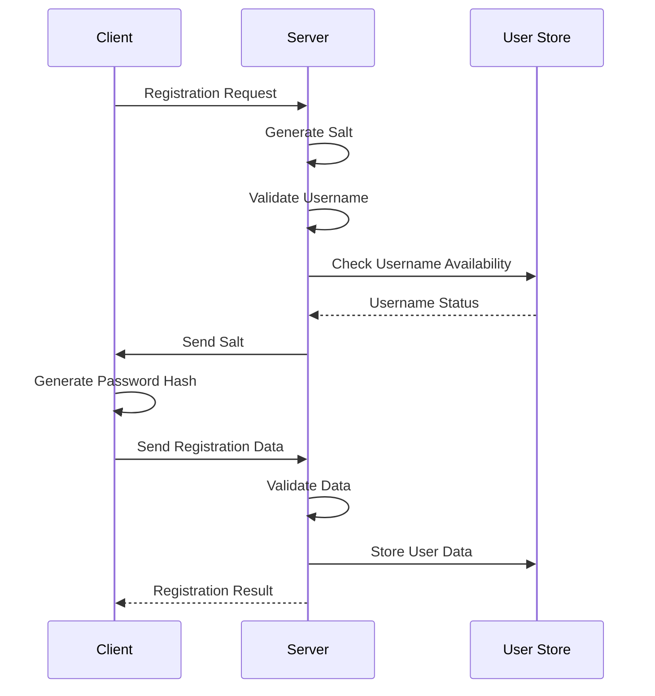
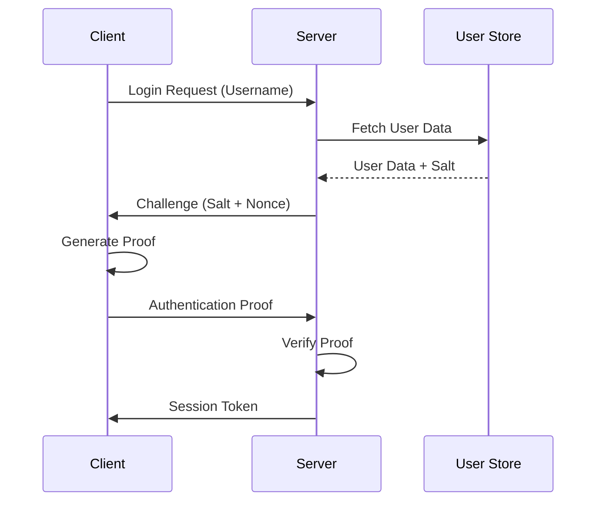
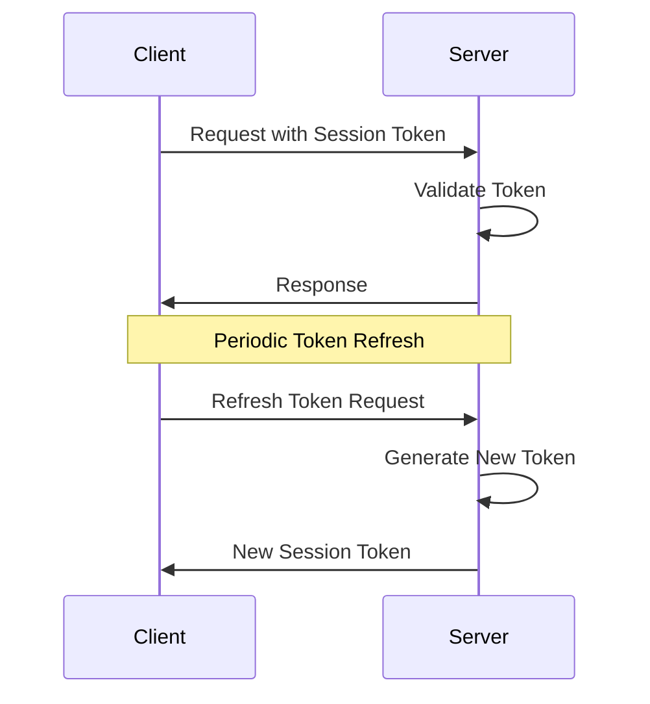

# Authentication System Design for Lair-Chat

## Overview

This document outlines the design for Lair-Chat's authentication system, providing secure user identity verification while maintaining the system's performance and usability characteristics.

## Goals

1. **Security**
   - Protect user identities and access
   - Prevent common attack vectors
   - Secure credential storage
   - Support future security enhancements

2. **Usability**
   - Simple registration process
   - Fast authentication
   - Clear error messages
   - Smooth recovery procedures

3. **Performance**
   - Minimal authentication overhead
   - Efficient session management
   - Scalable user storage
   - Low memory footprint

## Authentication Flow

### 1. Registration Flow



1. Client initiates registration with username
2. Server validates username and generates salt
3. Client receives salt and generates password hash
4. Server stores credentials and creates account
5. Registration confirmation sent to client

### 2. Login Flow



1. Client sends login request with username
2. Server retrieves user data and sends challenge
3. Client generates authentication proof
4. Server verifies proof and issues session token
5. Secure connection established

### 3. Session Management



1. Session tokens issued after successful authentication
2. Tokens include expiration and refresh mechanism
3. Periodic token validation and refresh
4. Secure token storage on client

## Technical Details

### 1. Password Handling

```rust
struct PasswordHash {
    algorithm: String,     // Currently "argon2id"
    salt: [u8; 32],       // Random salt
    hash: [u8; 32],       // Password hash
    params: HashParams,    // Algorithm parameters
}

struct HashParams {
    memory_cost: u32,     // Memory usage in KiB
    time_cost: u32,       // Number of iterations
    parallelism: u8,      // Threads to use
}
```

- Uses Argon2id for password hashing
- Configurable memory and CPU cost factors
- Unique salt per user
- Future-proof algorithm selection

### 2. User Data Storage

```rust
struct UserData {
    username: String,
    password_hash: PasswordHash,
    created_at: DateTime<Utc>,
    last_login: DateTime<Utc>,
    status: UserStatus,
    roles: Vec<Role>,
}

struct UserStore {
    storage: Box<dyn UserStorage>,
    cache: Arc<Cache<UserId, UserData>>,
}
```

- SQLite for persistent storage
- In-memory cache for active users
- Extensible storage interface
- Role-based access control

### 3. Session Management

```rust
struct Session {
    token: SessionToken,
    user_id: UserId,
    created_at: DateTime<Utc>,
    expires_at: DateTime<Utc>,
    refresh_token: RefreshToken,
}

struct SessionToken {
    id: Uuid,
    signature: [u8; 32],
}
```

- JWT-based session tokens
- Configurable expiration times
- Secure token rotation
- Rate-limited refresh

## Security Considerations

### 1. Attack Prevention

- Rate limiting on authentication attempts
- Account lockout after failed attempts
- IP-based blocking for suspicious activity
- Prevention of timing attacks

### 2. Secure Storage

- Encrypted credential storage
- Secure key management
- Regular security audits
- Backup and recovery procedures

### 3. Network Security

- TLS for all communications
- Certificate pinning
- Protocol-level encryption
- Secure key exchange

## Implementation Plan

### Phase 1: Core Authentication

1. Implement password hashing and verification
2. Create user storage system
3. Build basic authentication flow
4. Add session management

### Phase 2: Security Hardening

1. Add rate limiting
2. Implement account recovery
3. Add security monitoring
4. Create audit logging

### Phase 3: Advanced Features

1. Add role-based access control
2. Implement multi-factor authentication
3. Add OAuth support
4. Create admin interface

## API Endpoints

```rust
// Registration
POST /auth/register
{
    username: String,
    password_proof: PasswordProof,
    device_info: DeviceInfo,
}

// Login
POST /auth/login
{
    username: String,
    auth_proof: AuthProof,
}

// Session Management
POST /auth/refresh
GET /auth/validate
POST /auth/logout
```

## Error Handling

```rust
enum AuthError {
    InvalidCredentials,
    UserNotFound,
    UsernameTaken,
    RateLimitExceeded,
    SessionExpired,
    InvalidToken,
    ServerError,
}
```

Clear error messages and appropriate HTTP status codes for each error type.

## Monitoring and Metrics

1. Authentication attempts (success/failure)
2. Session statistics
3. Rate limit triggers
4. Security incidents
5. Performance metrics

## Future Enhancements

1. Multi-factor authentication
2. OAuth/OpenID integration
3. Hardware security key support
4. Biometric authentication
5. Enterprise SSO support

## Testing Strategy

1. Unit tests for core components
2. Integration tests for flows
3. Security penetration testing
4. Performance benchmarking
5. Stress testing

## Migration Strategy

1. Implement new system alongside existing
2. Gradually migrate users
3. Support legacy authentication temporarily
4. Remove old system after migration

## Success Criteria

1. Zero security incidents
2. 99.9% authentication success rate
3. Sub-100ms authentication time
4. Zero data breaches
5. High user satisfaction

## Maintenance Plan

1. Regular security audits
2. Performance monitoring
3. Dependency updates
4. User feedback collection
5. Continuous improvement