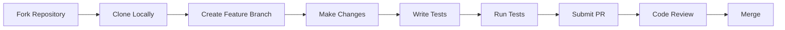

# Lair Chat Documentation

Welcome to the comprehensive documentation for Lair Chat - a secure, terminal-based chat application built with Rust.

## 📚 Documentation Structure

This documentation is organized into several key sections to help you get started, understand the architecture, and contribute to the project.

### For Users

| Document | Description |
|----------|-------------|
| [**User Guide**](guides/USER_GUIDE.md) | Complete guide for end users - installation, usage, and features |
| [**Font Compatibility Guide**](guides/font-compatibility.md) | Setting up fonts for the best visual experience |
| [**Migration Guide**](guides/migration-v0.6.0.md) | Upgrading from older versions |
| [**Styling Guide**](guides/styling-guide.md) | Customizing the appearance and themes |

### For Developers

| Document | Description |
|----------|-------------|
| [**Development Guide**](development/DEVELOPMENT_GUIDE.md) | Complete setup and contribution guide for developers |
| [**API Documentation**](api/README.md) | Comprehensive API reference and examples |
| [**Testing Strategy**](development/testing-strategy.md) | Testing approaches and best practices |
| [**Performance Baselines**](development/performance-baselines.md) | Performance benchmarks and optimization |

### Architecture & Design

| Document | Description |
|----------|-------------|
| [**Architecture Overview**](architecture/README.md) | System design, components, and data flow |
| [**Authentication Design**](architecture/authentication.md) | Security architecture and authentication flow |
| [**Transport Layer**](architecture/transport.md) | Network communication and protocols |
| [**Transport Examples**](architecture/transport-examples.md) | Implementation examples and patterns |
| [**Transport Flowcharts**](architecture/transport-flowcharts.md) | Visual diagrams of data flow |

### Project Management

| Document | Description |
|----------|-------------|
| [**Project Roadmap**](ROADMAP.md) | Strategic direction and planned development timeline |
| [**Release Notes**](releases/CHANGELOG.md) | Version history and release information |
| [**Development Plans**](development/) | Feature roadmaps and implementation plans |

## 🚀 Quick Start

New to Lair Chat? Start here:

1. **[User Guide](guides/USER_GUIDE.md)** - Get up and running quickly
2. **[Project Roadmap](ROADMAP.md)** - See what's planned for the future
3. **[API Documentation](api/README.md)** - For developers integrating with Lair Chat
4. **[Development Guide](development/DEVELOPMENT_GUIDE.md)** - For contributors

## 🏗️ Architecture at a Glance

```
┌─────────────────────────────────────────────────────────┐
│                    Client Application                   │
│  ┌─────────────┐  ┌─────────────┐  ┌─────────────┐     │
│  │     TUI     │  │    Chat     │  │    Auth     │     │
│  │  Interface  │  │   Logic     │  │  Service    │     │
│  └─────────────┘  └─────────────┘  └─────────────┘     │
│           │               │               │             │
│  ┌─────────────────────────────────────────────────┐   │
│  │              Transport Layer                    │   │
│  │         (TCP + AES-256-GCM Encryption)         │   │
│  └─────────────────────────────────────────────────┘   │
└─────────────────────────────────────────────────────────┘
                            │
                   ┌────────────────┐
                   │    Network     │
                   └────────────────┘
                            │
┌─────────────────────────────────────────────────────────┐
│                   Server Application                    │
│  ┌─────────────┐  ┌─────────────┐  ┌─────────────┐     │
│  │    Auth     │  │    Room     │  │   Message   │     │
│  │  Manager    │  │  Manager    │  │   Router    │     │
│  └─────────────┘  └─────────────┘  └─────────────┘     │
│           │               │               │             │
│  ┌─────────────────────────────────────────────────┐   │
│  │                  Storage                        │   │
│  │            (SQLite/PostgreSQL)                  │   │
│  └─────────────────────────────────────────────────┘   │
└─────────────────────────────────────────────────────────┘
```

## 🔐 Security Features

- **End-to-end encryption** with AES-256-GCM
- **Perfect forward secrecy** using X25519 key exchange
- **Secure authentication** with Argon2 password hashing
- **Memory safety** through Rust's ownership system
- **Transport security** with TLS 1.3

## 📊 Key Features

- **Real-time messaging** with sub-millisecond latency
- **Direct messaging** with conversation history
- **Chat rooms** with user management
- **Modern terminal UI** with intuitive navigation
- **Cross-platform support** (Linux, macOS, Windows)
- **Scalable architecture** supporting thousands of concurrent users

## 🤝 Contributing

We welcome contributions! Here's how to get started:

1. Read the [Development Guide](development/DEVELOPMENT_GUIDE.md)
2. Check our [contribution guidelines](development/DEVELOPMENT_GUIDE.md#contributing-guidelines)
3. Look at open issues or propose new features
4. Submit a pull request

### Development Workflow



## 📈 Performance

Lair Chat is designed for high performance:

- **10,000+ messages/second** throughput
- **<1ms** message processing latency
- **<50MB** memory usage per client
- **1,000+ concurrent connections** per server

See [Performance Baselines](development/performance-baselines.md) for detailed benchmarks.

## 🔄 Version History

| Version | Release Date | Key Features |
|---------|-------------|--------------|
| **v0.6.2** | **Current** | **Unread message tracking, UI improvements** |
| [v0.6.1](releases/v0.6.1.md) | Nov 2024 | Direct messaging enhancements |
| [v0.6.0](releases/v0.6.0.md) | Oct 2024 | Major architecture refactor |

### 🚀 Planned Releases
| Version | Target Date | Planned Features |
|---------|-------------|------------------|
| v0.7.0 | September 2025 | Theme system, enhanced navigation |
| v0.8.0 | December 2025 | Secure file sharing, rich content support |
| v0.9.0 | March 2026 | Plugin system, scalability improvements |

## 🛠️ Tools and Technologies

### Core Technologies
- **Rust** 1.70+ - Systems programming language
- **Tokio** - Async runtime
- **Ratatui** - Terminal user interface
- **Serde** - Serialization framework

### Security Stack
- **AES-256-GCM** - Symmetric encryption
- **X25519** - Key exchange
- **Argon2** - Password hashing
- **TLS 1.3** - Transport security

### Development Tools
- **Cargo** - Build system and package manager
- **Clippy** - Linting
- **Rustfmt** - Code formatting
- **Criterion** - Benchmarking

## 📞 Support

- **Documentation Issues**: Open an issue if you find problems with the docs
- **Feature Requests**: Use GitHub discussions for new feature ideas
- **Bug Reports**: Submit detailed bug reports via GitHub issues
- **Community**: Join our chat server to connect with other users

## 📄 License

This project is licensed under the MIT License - see the [LICENSE](../LICENSE) file for details.

---

**Note**: This documentation is continuously updated. If you find any outdated information or have suggestions for improvement, please contribute back to the project!

Last updated: June 2025