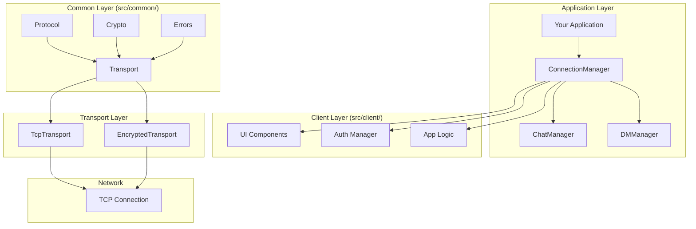
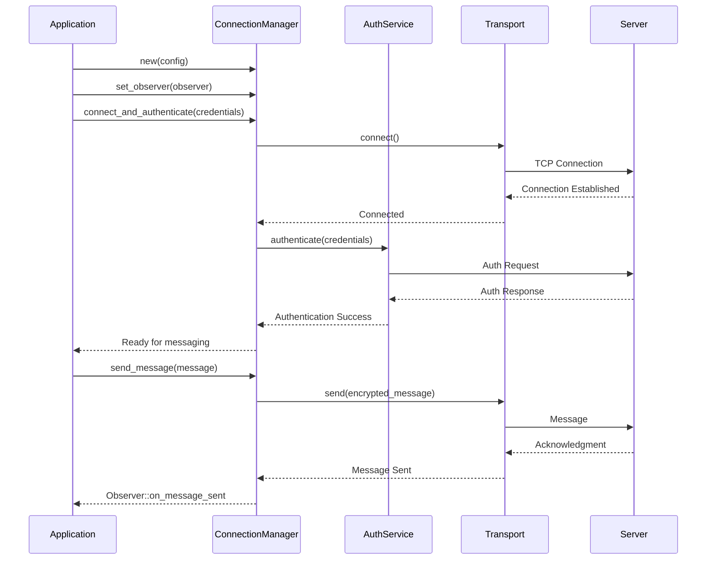
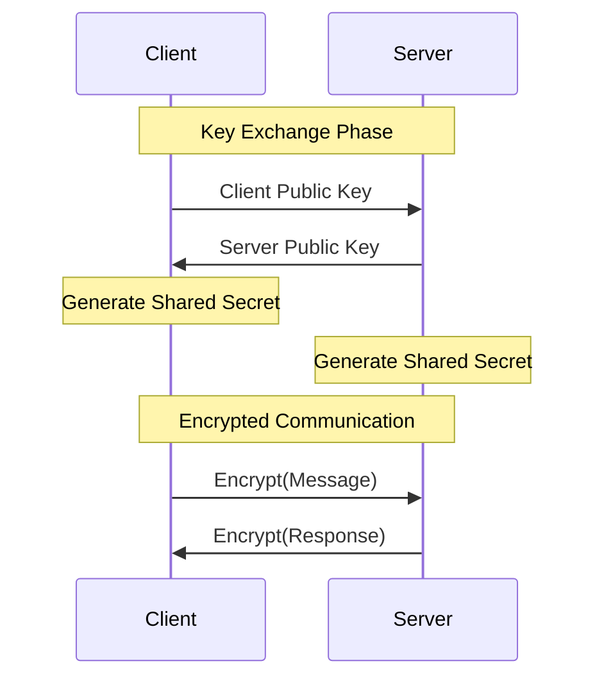
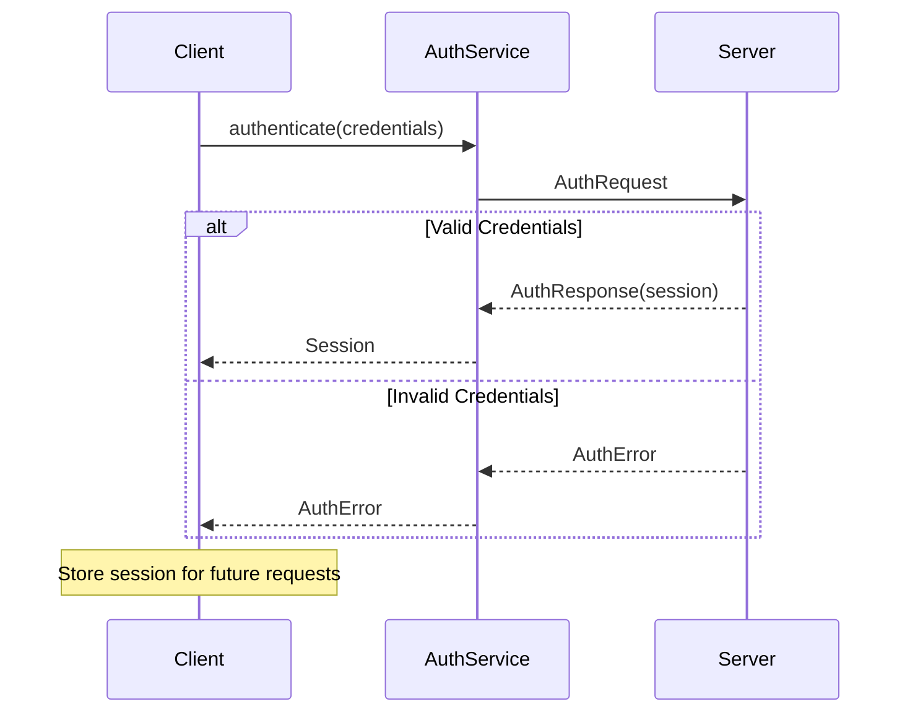
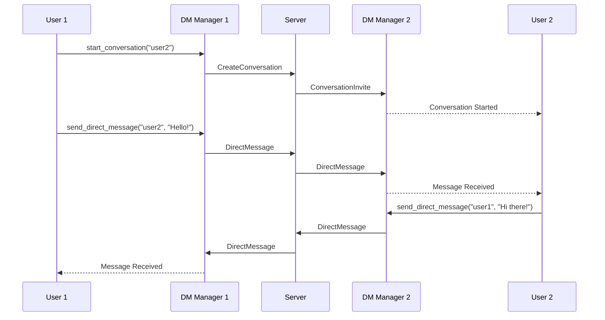

# Lair Chat API Documentation

**Version**: 0.6.2  
**Last Updated**: June 2025  
**API Stability**: Stable

## Table of Contents

1. [Overview](#overview)
2. [Quick Start](#quick-start)
3. [Core APIs](#core-apis)
4. [Transport Layer](#transport-layer)
5. [Encryption Services](#encryption-services)
6. [Authentication](#authentication)
7. [Chat Management](#chat-management)
8. [Direct Messaging](#direct-messaging)
9. [Error Handling](#error-handling)
10. [Observer Pattern](#observer-pattern)
11. [Configuration](#configuration)
12. [Examples](#examples)
13. [Migration Guide](#migration-guide)

## Overview

The Lair Chat API provides a modern, async-first interface for building secure chat applications. The API follows a modular architecture with clear separation between common functionality (shared between client/server), client-specific logic, and server-specific logic. The API is built around modular components that can be composed together for different use cases.

### Module Structure

- **`src/common/`**: Shared functionality between client and server
  - `protocol/`: Message types and protocol definitions
  - `crypto/`: Encryption utilities and cryptographic services
  - `transport/`: Network abstractions and transport layer
  - `errors/`: Common error types and utilities

- **`src/client/`**: Client-specific functionality
  - `ui/components/`: Terminal UI components and interfaces
  - `chat/`: Chat functionality and conversation management
  - `auth/`: Client-side authentication handling
  - `app.rs`: Main application logic and state management

- **`src/server/`**: Server-specific functionality
  - `app/`: Server application logic and configuration
  - `chat/`: Message handling and room management
  - `auth/`: Server-side authentication and session management
  - `network/`: Connection handling and session management

### Architecture Overview



### Core Principles

- **Async/Await**: All I/O operations are async
- **Type Safety**: Comprehensive error types and Result handling
- **Dependency Injection**: Configurable and testable components
- **Observer Pattern**: Event-driven notifications
- **Thread Safety**: Arc<Mutex<>> for shared state
- **Zero-Copy**: Efficient message handling where possible

## Quick Start

### Basic Usage

```rust
use lair_chat::client::{
    ConnectionManager, Credentials, TcpTransport,
    ConnectionObserver, ConnectionStatus
};
use lair_chat::transport::ConnectionConfig;
use async_trait::async_trait;

// 1. Implement observer for connection events
struct MyObserver;

#[async_trait]
impl ConnectionObserver for MyObserver {
    async fn on_message(&self, message: Message) {
        println!("Received: {}", message.content);
    }
    
    async fn on_status_change(&self, status: ConnectionStatus) {
        println!("Status changed to: {:?}", status);
    }
    
    async fn on_error(&self, error: TransportError) {
        eprintln!("Connection error: {}", error);
    }
}

#[tokio::main]
async fn main() -> Result<(), Box<dyn std::error::Error>> {
    // 2. Create configuration
    let config = ConnectionConfig {
        address: "127.0.0.1:8080".parse()?,
        timeout_ms: 5000,
        reconnect_attempts: 3,
        keepalive_interval: 30,
    };

    // 3. Create connection manager
    let mut connection_manager = ConnectionManager::new(config.clone());
    
    // 4. Set up observer
    let observer = Arc::new(MyObserver);
    connection_manager.set_observer(observer).await;

    // 5. Connect and authenticate
    let credentials = Credentials::new("username", "password");
    connection_manager.connect_and_authenticate(credentials).await?;

    // 6. Send a message
    let message = Message::new("Hello, World!", MessageType::Text);
    connection_manager.send_message(message).await?;

    Ok(())
}
```

## Core APIs

### ConnectionManager

The primary interface for chat functionality.

```rust
pub struct ConnectionManager {
    // Internal state
}

impl ConnectionManager {
    /// Create a new connection manager
    pub fn new(config: ConnectionConfig) -> Self;
    
    /// Set the connection observer
    pub async fn set_observer(&mut self, observer: Arc<dyn ConnectionObserver>);
    
    /// Connect and authenticate
    pub async fn connect_and_authenticate(
        &mut self, 
        credentials: Credentials
    ) -> Result<(), ConnectionError>;
    
    /// Send a message to the current room
    pub async fn send_message(&mut self, message: Message) -> Result<(), TransportError>;
    
    /// Join a chat room
    pub async fn join_room(&mut self, room_name: &str) -> Result<(), ChatError>;
    
    /// Leave current room
    pub async fn leave_room(&mut self) -> Result<(), ChatError>;
    
    /// Get current connection status
    pub fn get_status(&self) -> ConnectionStatus;
    
    /// Disconnect from server
    pub async fn disconnect(&mut self) -> Result<(), TransportError>;
}
```

### Message Structure

```rust
#[derive(Debug, Clone, Serialize, Deserialize)]
pub struct Message {
    pub id: MessageId,
    pub author: String,
    pub content: String,
    pub message_type: MessageType,
    pub timestamp: DateTime<Utc>,
    pub room: Option<String>,
    pub metadata: HashMap<String, String>,
}

#[derive(Debug, Clone, Serialize, Deserialize)]
pub enum MessageType {
    Text,
    System,
    DirectMessage,
    Notification,
    File { filename: String, size: u64 },
}

impl Message {
    /// Create a new text message
    pub fn new(content: &str, message_type: MessageType) -> Self;
    
    /// Create a direct message
    pub fn direct_message(recipient: &str, content: &str) -> Self;
    
    /// Create a system message
    pub fn system(content: &str) -> Self;
    
    /// Add metadata to the message
    pub fn with_metadata(mut self, key: &str, value: &str) -> Self;
}
```

### Connection Flow



## Transport Layer

### Transport Trait

```rust
#[async_trait]
pub trait Transport: Send + Sync {
    /// Send data over the transport
    async fn send(&mut self, data: &[u8]) -> Result<(), TransportError>;
    
    /// Receive data from the transport
    async fn receive(&mut self) -> Result<Vec<u8>, TransportError>;
    
    /// Check if the transport is connected
    fn is_connected(&self) -> bool;
    
    /// Close the transport connection
    async fn close(&mut self) -> Result<(), TransportError>;
    
    /// Get transport statistics
    fn stats(&self) -> TransportStats;
}
```

### TCP Transport

```rust
pub struct TcpTransport {
    stream: Option<TcpStream>,
    config: TcpConfig,
    stats: TransportStats,
}

impl TcpTransport {
    /// Create a new TCP transport
    pub fn new(config: TcpConfig) -> Self;
    
    /// Connect to the specified address
    pub async fn connect(&mut self, addr: SocketAddr) -> Result<(), TransportError>;
    
    /// Set connection timeout
    pub fn set_timeout(&mut self, timeout: Duration);
    
    /// Enable keep-alive
    pub fn set_keepalive(&mut self, interval: Duration) -> Result<(), TransportError>;
}

#[derive(Debug, Clone)]
pub struct TcpConfig {
    pub connect_timeout: Duration,
    pub read_timeout: Duration,
    pub write_timeout: Duration,
    pub keepalive_interval: Option<Duration>,
    pub nodelay: bool,
}
```

### Encrypted Transport

```rust
pub struct EncryptedTransport {
    inner: Box<dyn Transport>,
    encryption: Arc<dyn EncryptionService>,
}

impl EncryptedTransport {
    /// Wrap a transport with encryption
    pub fn new(
        transport: Box<dyn Transport>,
        encryption: Arc<dyn EncryptionService>
    ) -> Self;
    
    /// Perform key exchange with the remote peer
    pub async fn perform_key_exchange(&mut self) -> Result<(), EncryptionError>;
}
```

## Encryption Services

### Encryption Service Trait

```rust
#[async_trait]
pub trait EncryptionService: Send + Sync {
    /// Encrypt data
    async fn encrypt(&self, data: &[u8]) -> Result<Vec<u8>, EncryptionError>;
    
    /// Decrypt data
    async fn decrypt(&self, data: &[u8]) -> Result<Vec<u8>, EncryptionError>;
    
    /// Get encryption algorithm information
    fn algorithm_info(&self) -> AlgorithmInfo;
    
    /// Perform key exchange
    async fn key_exchange(&mut self, peer_public_key: &[u8]) -> Result<Vec<u8>, EncryptionError>;
}
```

### AES-GCM Encryption

```rust
pub struct AesGcmEncryption {
    cipher: Aes256Gcm,
    nonce_counter: AtomicU64,
}

impl AesGcmEncryption {
    /// Create a new AES-GCM encryption service
    pub fn new(key: &[u8]) -> Result<Self, EncryptionError>;
    
    /// Create from X25519 shared secret
    pub fn from_shared_secret(shared_secret: &[u8]) -> Result<Self, EncryptionError>;
    
    /// Generate a new random key
    pub fn generate_key() -> [u8; 32];
}
```

### Key Exchange

```rust
pub struct X25519KeyExchange {
    private_key: StaticSecret,
    public_key: PublicKey,
}

impl X25519KeyExchange {
    /// Generate a new key pair
    pub fn new() -> Self;
    
    /// Get the public key for sharing
    pub fn public_key(&self) -> &PublicKey;
    
    /// Perform key exchange with peer's public key
    pub fn exchange(&self, peer_public_key: &PublicKey) -> SharedSecret;
}
```

### Encryption Flow



## Authentication

### Authentication Service

```rust
pub struct AuthService {
    credentials: Option<Credentials>,
    session: Option<Session>,
    rate_limiter: RateLimiter,
}

impl AuthService {
    /// Create a new authentication service
    pub fn new(config: AuthConfig) -> Self;
    
    /// Authenticate with username and password
    pub async fn authenticate(
        &mut self,
        credentials: Credentials
    ) -> Result<Session, AuthError>;
    
    /// Register a new user
    pub async fn register(
        &mut self,
        username: &str,
        password: &str,
        email: Option<&str>
    ) -> Result<(), AuthError>;
    
    /// Refresh the current session
    pub async fn refresh_session(&mut self) -> Result<Session, AuthError>;
    
    /// Logout and invalidate session
    pub async fn logout(&mut self) -> Result<(), AuthError>;
    
    /// Check if currently authenticated
    pub fn is_authenticated(&self) -> bool;
}
```

### Credentials and Session

```rust
#[derive(Debug, Clone)]
pub struct Credentials {
    pub username: String,
    pub password: String,
}

impl Credentials {
    pub fn new(username: &str, password: &str) -> Self;
}

#[derive(Debug, Clone, Serialize, Deserialize)]
pub struct Session {
    pub token: String,
    pub user_id: String,
    pub username: String,
    pub expires_at: DateTime<Utc>,
    pub permissions: Vec<Permission>,
}

#[derive(Debug, Clone, Serialize, Deserialize)]
pub enum Permission {
    SendMessage,
    CreateRoom,
    ModerateRoom,
    AdminAccess,
}
```

### Authentication Flow



## Chat Management

### Room Manager

```rust
pub struct RoomManager {
    current_room: Option<String>,
    rooms: HashMap<String, RoomInfo>,
    users: HashMap<String, UserInfo>,
}

impl RoomManager {
    /// Create a new room manager
    pub fn new() -> Self;
    
    /// Join a room
    pub async fn join_room(&mut self, room_name: &str) -> Result<(), ChatError>;
    
    /// Leave the current room
    pub async fn leave_room(&mut self) -> Result<(), ChatError>;
    
    /// Get current room information
    pub fn current_room(&self) -> Option<&RoomInfo>;
    
    /// List available rooms
    pub fn list_rooms(&self) -> Vec<&RoomInfo>;
    
    /// Get users in current room
    pub fn room_users(&self) -> Vec<&UserInfo>;
    
    /// Send message to current room
    pub async fn send_message(&mut self, content: &str) -> Result<(), ChatError>;
}

#[derive(Debug, Clone)]
pub struct RoomInfo {
    pub name: String,
    pub topic: Option<String>,
    pub user_count: usize,
    pub room_type: RoomType,
    pub created_at: DateTime<Utc>,
}

#[derive(Debug, Clone)]
pub enum RoomType {
    Public,
    Private,
    Direct,
}
```

## Direct Messaging

### DM Conversation Manager

```rust
pub struct DMConversationManager {
    conversations: HashMap<String, Conversation>,
    unread_counts: HashMap<String, usize>,
}

impl DMConversationManager {
    /// Create a new DM manager
    pub fn new() -> Self;
    
    /// Start a new conversation
    pub async fn start_conversation(&mut self, username: &str) -> Result<(), ChatError>;
    
    /// Send a direct message
    pub async fn send_direct_message(
        &mut self,
        recipient: &str,
        content: &str
    ) -> Result<(), ChatError>;
    
    /// Get conversation history
    pub fn get_conversation(&self, username: &str) -> Option<&Conversation>;
    
    /// List all conversations
    pub fn list_conversations(&self) -> Vec<&Conversation>;
    
    /// Get unread message count
    pub fn unread_count(&self, username: &str) -> usize;
    
    /// Mark conversation as read
    pub fn mark_as_read(&mut self, username: &str);
}

#[derive(Debug, Clone)]
pub struct Conversation {
    pub participant: String,
    pub messages: Vec<Message>,
    pub last_activity: DateTime<Utc>,
    pub unread_count: usize,
}
```

### DM Flow



## Error Handling

### Error Types

```rust
#[derive(thiserror::Error, Debug)]
pub enum ConnectionError {
    #[error("Transport error: {0}")]
    Transport(#[from] TransportError),
    
    #[error("Authentication failed: {0}")]
    Authentication(#[from] AuthError),
    
    #[error("Encryption error: {0}")]
    Encryption(#[from] EncryptionError),
    
    #[error("Connection timeout")]
    Timeout,
    
    #[error("Connection refused")]
    Refused,
}

#[derive(thiserror::Error, Debug)]
pub enum TransportError {
    #[error("Network I/O error: {0}")]
    Io(#[from] std::io::Error),
    
    #[error("Connection closed")]
    ConnectionClosed,
    
    #[error("Protocol error: {message}")]
    Protocol { message: String },
    
    #[error("Timeout occurred")]
    Timeout,
}

#[derive(thiserror::Error, Debug)]
pub enum ChatError {
    #[error("Room not found: {room}")]
    RoomNotFound { room: String },
    
    #[error("User not found: {user}")]
    UserNotFound { user: String },
    
    #[error("Permission denied: {action}")]
    PermissionDenied { action: String },
    
    #[error("Message too long: {length} > {max}")]
    MessageTooLong { length: usize, max: usize },
}
```

### Error Handling Patterns

```rust
// Result chaining
async fn send_message_with_retry(
    connection: &mut ConnectionManager,
    message: Message,
    max_retries: usize,
) -> Result<(), ConnectionError> {
    for attempt in 0..max_retries {
        match connection.send_message(message.clone()).await {
            Ok(()) => return Ok(()),
            Err(e) if attempt < max_retries - 1 => {
                eprintln!("Attempt {} failed: {}, retrying...", attempt + 1, e);
                tokio::time::sleep(Duration::from_secs(1)).await;
            }
            Err(e) => return Err(e.into()),
        }
    }
    unreachable!()
}

// Error context with map_err
connection.send_message(message)
    .await
    .map_err(|e| ChatError::Protocol { 
        message: format!("Failed to send message: {}", e) 
    })?;
```

## Observer Pattern

### Connection Observer

```rust
#[async_trait]
pub trait ConnectionObserver: Send + Sync {
    /// Called when a message is received
    async fn on_message(&self, message: Message);
    
    /// Called when connection status changes
    async fn on_status_change(&self, status: ConnectionStatus);
    
    /// Called when an error occurs
    async fn on_error(&self, error: TransportError);
    
    /// Called when a user joins the room
    async fn on_user_joined(&self, user: UserInfo) {}
    
    /// Called when a user leaves the room
    async fn on_user_left(&self, user: UserInfo) {}
    
    /// Called when a direct message is received
    async fn on_direct_message(&self, message: Message) {}
}

#[derive(Debug, Clone)]
pub enum ConnectionStatus {
    Disconnected,
    Connecting,
    Connected,
    Authenticating,
    Authenticated,
    Error { message: String },
}
```

### Observer Implementation Example

```rust
use std::sync::Arc;
use tokio::sync::Mutex;

pub struct ChatObserver {
    ui_sender: Arc<Mutex<mpsc::Sender<UiEvent>>>,
}

impl ChatObserver {
    pub fn new(ui_sender: mpsc::Sender<UiEvent>) -> Self {
        Self {
            ui_sender: Arc::new(Mutex::new(ui_sender)),
        }
    }
}

#[async_trait]
impl ConnectionObserver for ChatObserver {
    async fn on_message(&self, message: Message) {
        let sender = self.ui_sender.lock().await;
        let _ = sender.send(UiEvent::MessageReceived(message)).await;
    }
    
    async fn on_status_change(&self, status: ConnectionStatus) {
        let sender = self.ui_sender.lock().await;
        let _ = sender.send(UiEvent::StatusChanged(status)).await;
    }
    
    async fn on_error(&self, error: TransportError) {
        let sender = self.ui_sender.lock().await;
        let _ = sender.send(UiEvent::Error(error.to_string())).await;
    }
}
```

## Configuration

### Connection Configuration

```rust
#[derive(Debug, Clone)]
pub struct ConnectionConfig {
    /// Server address
    pub address: SocketAddr,
    
    /// Connection timeout in milliseconds
    pub timeout_ms: u64,
    
    /// Number of reconnection attempts
    pub reconnect_attempts: usize,
    
    /// Interval between keepalive messages
    pub keepalive_interval: u64,
    
    /// Enable encryption
    pub encryption_enabled: bool,
    
    /// Compression settings
    pub compression: CompressionConfig,
}

#[derive(Debug, Clone)]
pub struct CompressionConfig {
    pub enabled: bool,
    pub algorithm: CompressionAlgorithm,
    pub level: u8,
}

#[derive(Debug, Clone)]
pub enum CompressionAlgorithm {
    None,
    Gzip,
    Deflate,
    Brotli,
}
```

### Configuration Loading

```rust
impl ConnectionConfig {
    /// Load configuration from file
    pub fn from_file<P: AsRef<Path>>(path: P) -> Result<Self, ConfigError>;
    
    /// Load from environment variables
    pub fn from_env() -> Result<Self, ConfigError>;
    
    /// Create with defaults
    pub fn default() -> Self;
    
    /// Builder pattern for configuration
    pub fn builder() -> ConnectionConfigBuilder;
}

pub struct ConnectionConfigBuilder {
    config: ConnectionConfig,
}

impl ConnectionConfigBuilder {
    pub fn address(mut self, addr: SocketAddr) -> Self {
        self.config.address = addr;
        self
    }
    
    pub fn timeout(mut self, timeout_ms: u64) -> Self {
        self.config.timeout_ms = timeout_ms;
        self
    }
    
    pub fn build(self) -> ConnectionConfig {
        self.config
    }
}
```

## Examples

### Complete Chat Client

```rust
use lair_chat::client::*;
use std::sync::Arc;
use tokio::sync::mpsc;

struct SimpleChatClient {
    connection: ConnectionManager,
    ui_receiver: mpsc::Receiver<UiEvent>,
}

impl SimpleChatClient {
    pub async fn new(server_addr: &str) -> Result<Self, Box<dyn std::error::Error>> {
        let config = ConnectionConfig::builder()
            .address(server_addr.parse()?)
            .timeout(5000)
            .build();
        
        let mut connection = ConnectionManager::new(config);
        
        let (ui_sender, ui_receiver) = mpsc::channel(100);
        let observer = Arc::new(ChatObserver::new(ui_sender));
        connection.set_observer(observer).await;
        
        Ok(Self {
            connection,
            ui_receiver,
        })
    }
    
    pub async fn login(&mut self, username: &str, password: &str) -> Result<(), Box<dyn std::error::Error>> {
        let credentials = Credentials::new(username, password);
        self.connection.connect_and_authenticate(credentials).await?;
        Ok(())
    }
    
    pub async fn send_message(&mut self, content: &str) -> Result<(), Box<dyn std::error::Error>> {
        let message = Message::new(content, MessageType::Text);
        self.connection.send_message(message).await?;
        Ok(())
    }
    
    pub async fn run(&mut self) -> Result<(), Box<dyn std::error::Error>> {
        loop {
            tokio::select! {
                event = self.ui_receiver.recv() => {
                    match event {
                        Some(UiEvent::MessageReceived(msg)) => {
                            println!("[{}] {}: {}", msg.timestamp, msg.author, msg.content);
                        }
                        Some(UiEvent::StatusChanged(status)) => {
                            println!("Status: {:?}", status);
                        }
                        Some(UiEvent::Error(err)) => {
                            eprintln!("Error: {}", err);
                        }
                        None => break,
                    }
                }
                _ = tokio::signal::ctrl_c() => {
                    println!("Shutting down...");
                    break;
                }
            }
        }
        Ok(())
    }
}

#[tokio::main]
async fn main() -> Result<(), Box<dyn std::error::Error>> {
    let mut client = SimpleChatClient::new("127.0.0.1:8080").await?;
    client.login("alice", "password123").await?;
    client.run().await?;
    Ok(())
}
```

### Custom Transport Implementation

```rust
use async_trait::async_trait;
use lair_chat::transport::{Transport, TransportError, TransportStats};

pub struct WebSocketTransport {
    // WebSocket implementation details
}

#[async_trait]
impl Transport for WebSocketTransport {
    async fn send(&mut self, data: &[u8]) -> Result<(), TransportError> {
        // Send WebSocket message
        Ok(())
    }
    
    async fn receive(&mut self) -> Result<Vec<u8>, TransportError> {
        // Receive WebSocket message
        Ok(vec![])
    }
    
    fn is_connected(&self) -> bool {
        // Check WebSocket connection status
        true
    }
    
    async fn close(&mut self) -> Result<(), TransportError> {
        // Close WebSocket connection
        Ok(())
    }
    
    fn stats(&self) -> TransportStats {
        TransportStats::default()
    }
}
```

## Migration Guide

### From v0.5.x to v0.6.x

#### Breaking Changes

1. **Connection API Changes**:
   ```rust
   // Old (v0.5.x)
   let mut client = ChatClient::new();
   client.connect("127.0.0.1:8080").await?;
   client.authenticate("username", "password").await?;
   
   // New (v0.6.x)
   let config = ConnectionConfig::builder()
       .address("127.0.0.1:8080".parse()?)
       .build();
   let mut connection = ConnectionManager::new(config);
   let credentials = Credentials::new("username", "password");
   connection.connect_and_authenticate(credentials).await?;
   ```

2. **Message Structure Changes**:
   ```rust
   // Old (v0.5.x)
   let message = ChatMessage {
       content: "Hello".to_string(),
       user: "alice".to_string(),
   };
   
   // New (v0.6.x)
   let message = Message::new("Hello", MessageType::Text);
   ```

3. **Error Handling**:
   ```rust
   // Old (v0.5.x)
   match client.send_message(msg).await {
       Ok(_) => println!("Sent"),
       Err(e) => println!("Error: {}", e),
   }
   
   // New (v0.6.x)
   match connection.send_message(msg).await {
       Ok(_) => println!("Sent"),
       Err(ConnectionError::Transport(e)) => println!("Transport error: {}", e),
       Err(ConnectionError::Authentication(e)) => println!("Auth error: {}", e),
       Err(e) => println!("Other error: {}", e),
   }
   ```

#### Migration Steps

1. Update `Cargo.toml`:
   ```toml
   [dependencies]
   lair-chat = "0.6.2"
   ```

2. Update imports:
   ```rust
   // Add new imports
   use lair_chat::client::{ConnectionManager, Credentials};
   use lair_chat::transport::ConnectionConfig;
   ```

3. Update connection code using the examples above

4. Update error handling to use the new error types

5. Test thoroughly, especially authentication and message sending

---

For more examples and advanced usage, see the [examples/](../../examples/) directory and the [User Guide](../guides/USER_GUIDE.md).

---

*Documentation last updated: June 2025 (reflects current v0.6.2 codebase)*