# Lair Chat Architecture Documentation

This document provides a comprehensive overview of the Lair Chat architecture, covering system design, component interactions, data flow, and key architectural decisions.

## Table of Contents

1. [System Overview](#system-overview)
2. [Architecture Principles](#architecture-principles)
3. [Component Architecture](#component-architecture)
4. [Data Flow Diagrams](#data-flow-diagrams)
5. [Security Architecture](#security-architecture)
6. [Transport Layer](#transport-layer)
7. [Storage Architecture](#storage-architecture)
8. [Scalability Considerations](#scalability-considerations)
9. [Performance Architecture](#performance-architecture)
10. [Deployment Architecture](#deployment-architecture)

## System Overview

Lair Chat is a distributed, real-time chat application built with Rust, featuring a client-server architecture with end-to-end encryption, direct messaging, and room-based communication.

### High-Level Architecture

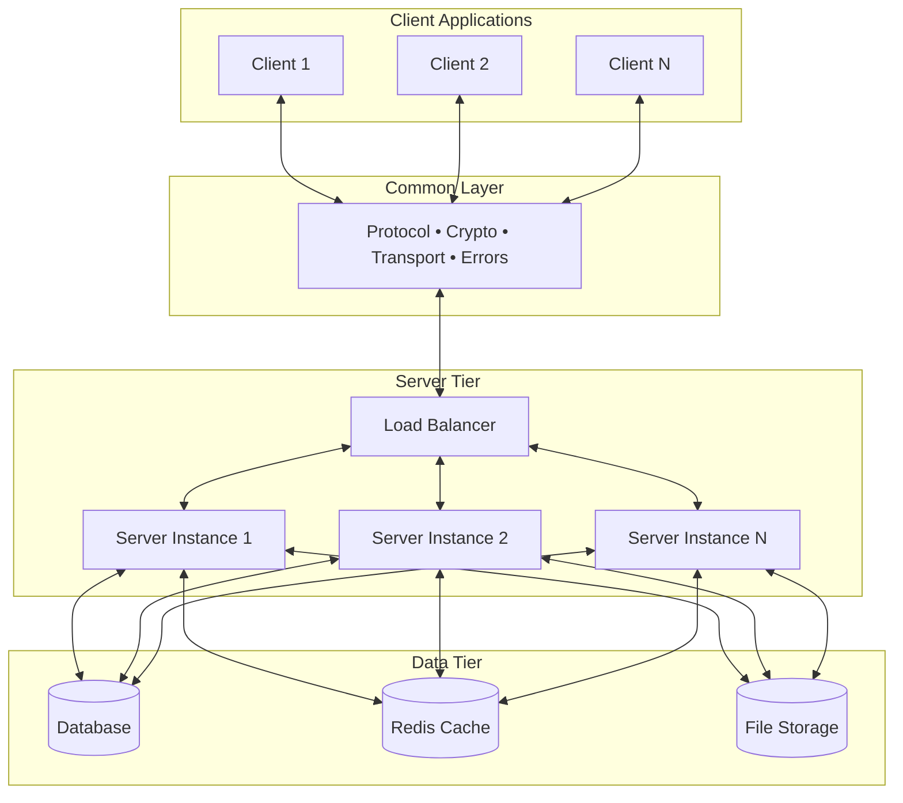

### Modular Project Structure

```
src/
├── bin/                    # Binary entry points
│   ├── client.rs          # Client application entry
│   └── server.rs          # Server application entry
├── common/                 # Shared functionality
│   ├── protocol/          # Message types & protocols  
│   ├── crypto/            # Encryption utilities
│   ├── transport/         # Network abstractions
│   └── errors/            # Common error types
├── client/                 # Client-specific code
│   ├── ui/components/     # UI components & TUI
│   ├── chat/              # Chat functionality
│   ├── auth/              # Client authentication
│   └── app/               # Application logic
└── server/                 # Server-specific code
    ├── app/               # Server application logic
    ├── chat/              # Message & room handling
    ├── auth/              # Server authentication
    └── network/           # Connection management
```

### Technology Stack

| Layer | Technologies |
|-------|-------------|
| **Client** | Rust, Ratatui, Tokio, Crossterm |
| **Server** | Rust, Tokio, Serde, Clap |
| **Transport** | TCP, WebSocket (future), HTTP/2 (future) |
| **Encryption** | AES-256-GCM, X25519, Argon2 |
| **Serialization** | JSON, MessagePack (future) |
| **Storage** | SQLite (embedded), PostgreSQL (production) |
| **Caching** | In-memory, Redis (distributed) |

## Architecture Principles

### Core Principles

1. **Security First**
   - End-to-end encryption by default
   - Zero-trust architecture
   - Secure by design, not by addition

2. **Performance**
   - Async/await throughout
   - Zero-copy where possible
   - Efficient serialization

3. **Reliability**
   - Graceful degradation
   - Automatic reconnection
   - Error recovery

4. **Scalability**
   - Horizontal scaling capability
   - Stateless server design
   - Efficient resource utilization

5. **Maintainability**
   - Clean separation of concerns
   - Dependency injection
   - Comprehensive testing

### Design Patterns

- **Observer Pattern**: Event-driven UI updates
- **Strategy Pattern**: Pluggable transport and encryption
- **Factory Pattern**: Component creation and configuration
- **Command Pattern**: Message handling and routing
- **Singleton Pattern**: Global configuration and state

## Component Architecture

### Client Architecture

The client follows a layered architecture with clear separation of concerns:

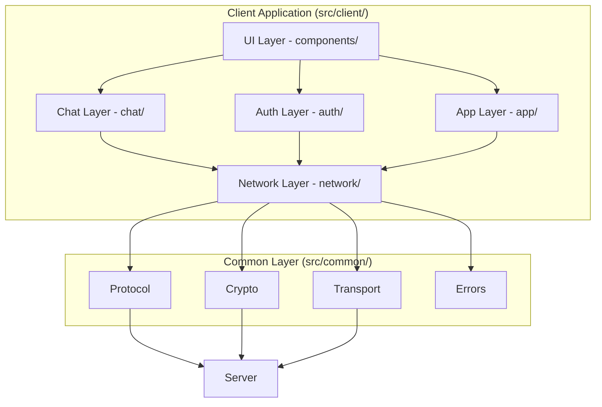
    subgraph "Presentation Layer"
        TUI[Terminal UI]
        COMP[UI Components]
        EVENTS[Event Handler]
    end
    
    subgraph "Application Layer"
        APP[Application Core]
        CONFIG[Configuration]
        HISTORY[Command History]
    end
    
    subgraph "Domain Layer"
        CHAT[Chat Manager]
        DM[DM Manager]
        ROOM[Room Manager]
        USER[User Manager]
    end
    
    subgraph "Infrastructure Layer"
        CONN[Connection Manager]
        TRANS[Transport Layer]
        CRYPTO[Encryption Service]
        AUTH[Auth Service]
        STORE[Local Storage]
    end
    
    TUI --> APP
    COMP --> APP
    EVENTS --> APP
    
    APP --> CHAT
    APP --> DM
    APP --> ROOM
    APP --> USER
    
    CHAT --> CONN
    DM --> CONN
    ROOM --> CONN
    USER --> CONN
    
    CONN --> TRANS
    CONN --> CRYPTO
    CONN --> AUTH
    CONN --> STORE
```

#### Client Components

1. **Terminal UI (TUI)**
   - Renders the user interface using Ratatui
   - Handles keyboard and mouse input
   - Manages screen layout and widgets

2. **Application Core**
   - Coordinates between UI and business logic
   - Manages application state
   - Handles configuration

3. **Chat Manager**
   - Manages chat rooms and conversations
   - Handles message history
   - Coordinates with UI for display

4. **Connection Manager**
   - Manages server connections
   - Handles reconnection logic
   - Coordinates transport and encryption

5. **Transport Layer**
   - Abstracts network communication
   - Supports multiple protocols
   - Handles connection lifecycle

### Server Architecture

The server follows a modular architecture with clear separation of concerns:

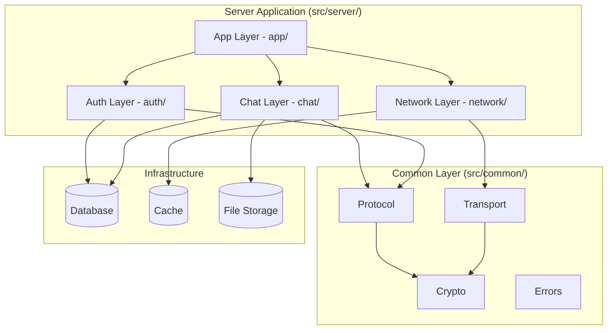

#### Detailed Server Components

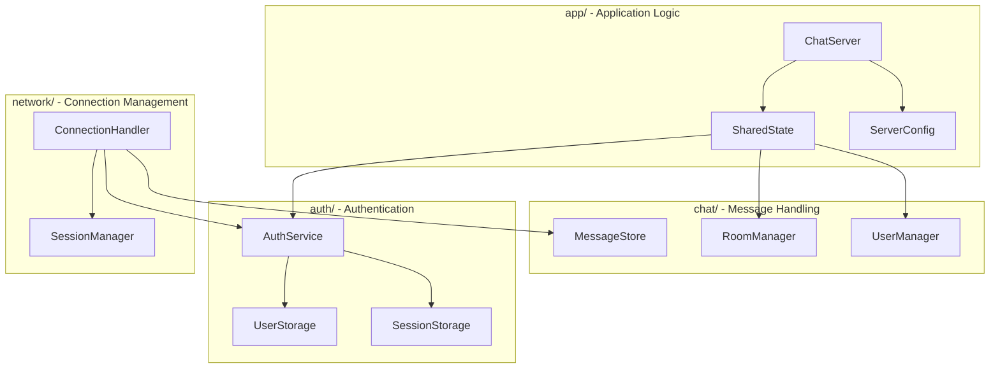

#### Server Components

1. **ChatServer (src/server/app/server.rs)**
   - Main server application entry point
   - Manages server configuration and lifecycle
   - Coordinates all server components

2. **SharedState (src/server/app/state.rs)**
   - Central state management for the server
   - Manages peer connections and user sessions
   - Handles room assignments and user tracking

3. **RoomManager (src/server/chat/rooms.rs)**
   - Manages chat rooms and participants
   - Handles room creation, deletion, and permissions
   - Coordinates room-based message broadcasting

4. **UserManager (src/server/chat/users.rs)**
   - Tracks connected users and their presence
   - Manages user sessions and activity
   - Handles user movement between rooms

5. **MessageStore (src/server/chat/messages.rs)**
   - Persists and retrieves chat messages
   - Handles message validation and lifecycle
   - Supports direct messages and room messages

6. **AuthService (src/server/auth/service.rs)**
   - Handles user authentication and authorization
   - Manages sessions and tokens
   - Implements rate limiting and security policies

7. **ConnectionHandler (src/server/network/connection_handler.rs)**
   - Manages individual client connections
   - Handles connection lifecycle and cleanup
   - Coordinates authentication and message processing

8. **SessionManager (src/server/network/session_manager.rs)**
   - Tracks active user sessions
   - Manages session timeouts and cleanup
   - Provides session statistics and monitoring

## Data Flow Diagrams

### Message Flow

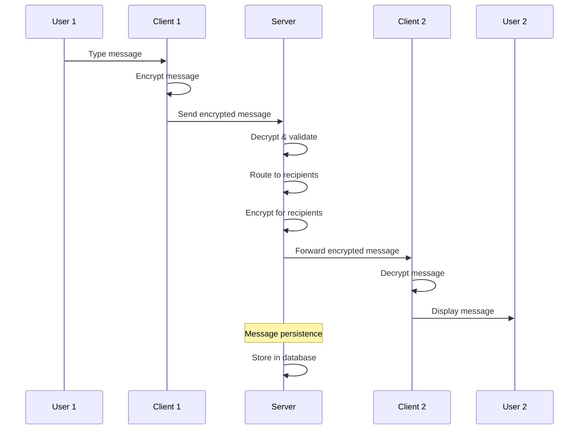

### Authentication Flow

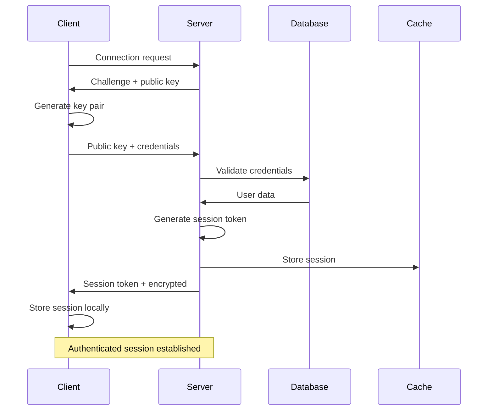

### Direct Message Flow

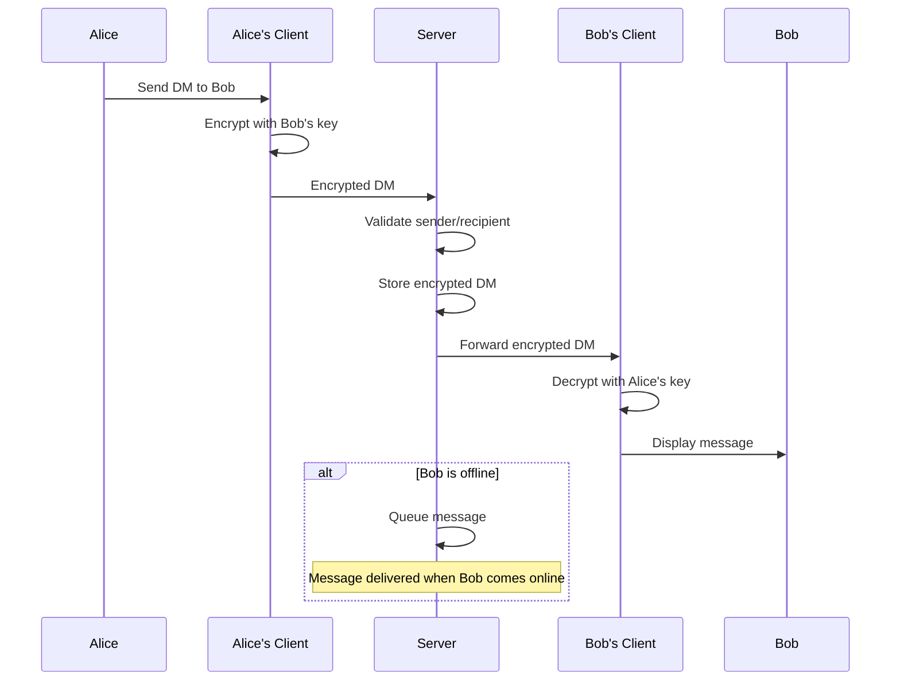

## Security Architecture

### Encryption Architecture

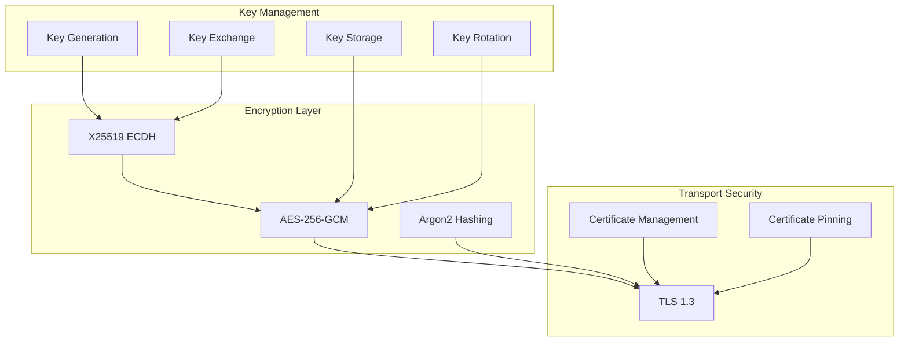

### Security Layers

1. **Transport Layer Security**
   - TLS 1.3 for all connections
   - Certificate pinning
   - Perfect Forward Secrecy

2. **Application Layer Security**
   - End-to-end encryption with AES-256-GCM
   - X25519 key exchange
   - Message authentication codes

3. **Authentication Security**
   - Argon2 password hashing
   - Session token management
   - Rate limiting and brute force protection

4. **Data Security**
   - Encrypted storage of sensitive data
   - Secure key derivation
   - Memory-safe operations

### Threat Model

| Threat | Mitigation |
|--------|------------|
| **Man-in-the-middle** | TLS + Certificate pinning |
| **Message interception** | End-to-end encryption |
| **Password attacks** | Argon2 + Rate limiting |
| **Session hijacking** | Secure tokens + HTTPS only |
| **Data breach** | Encrypted storage |
| **Memory attacks** | Memory-safe Rust + Zeroization |

## Transport Layer

### Transport Abstraction

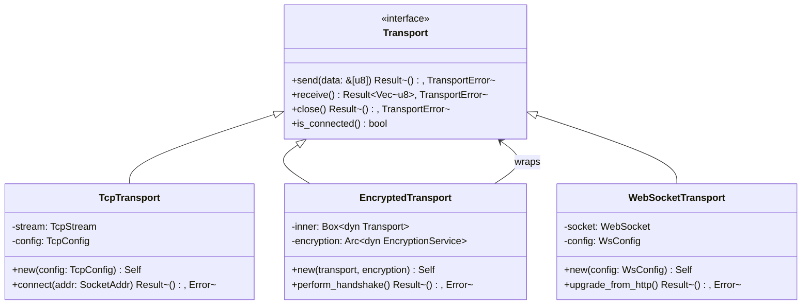

### Protocol Stack

```
┌─────────────────────────────────────┐
│           Application Layer         │
│        (Chat Protocol)              │
├─────────────────────────────────────┤
│          Encryption Layer           │
│         (AES-256-GCM)               │
├─────────────────────────────────────┤
│          Transport Layer            │
│      (TCP/WebSocket/HTTP/2)         │
├─────────────────────────────────────┤
│           Security Layer            │
│            (TLS 1.3)                │
├─────────────────────────────────────┤
│          Network Layer              │
│             (TCP/IP)                │
└─────────────────────────────────────┘
```

## Storage Architecture

### Data Model

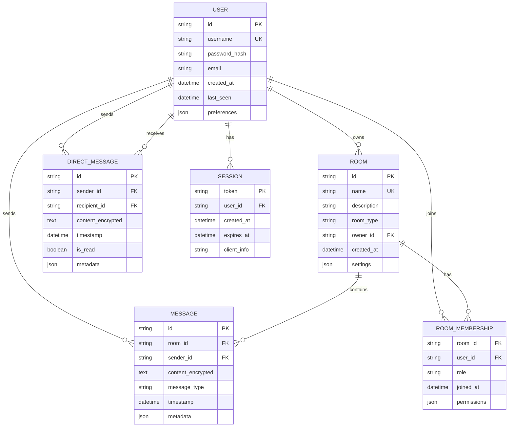

### Storage Strategy

1. **Hot Data (In-Memory/Cache)**
   - Active sessions
   - Online users
   - Recent messages
   - Connection states

2. **Warm Data (Database)**
   - User profiles
   - Room configurations
   - Message history (recent)
   - Authentication data

3. **Cold Data (File Storage)**
   - Old message archives
   - File attachments
   - Backup data
   - Logs and analytics

## Scalability Considerations

### Horizontal Scaling

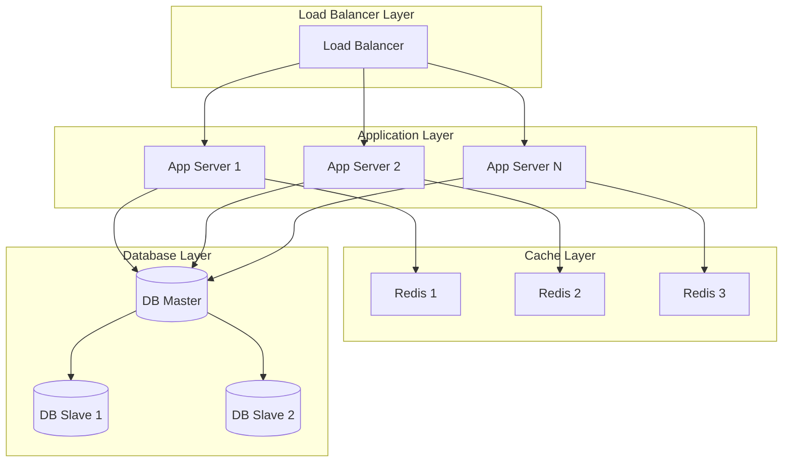

### Scaling Strategies

1. **Stateless Application Servers**
   - Session data in Redis
   - No server affinity required
   - Easy horizontal scaling

2. **Database Scaling**
   - Read replicas for queries
   - Sharding by user ID
   - Connection pooling

3. **Cache Scaling**
   - Redis cluster for distributed caching
   - Consistent hashing
   - Cache invalidation strategies

4. **Message Broadcasting**
   - Pub/Sub pattern for real-time updates
   - Message queues for reliability
   - WebSocket connection management

## Performance Architecture

### Performance Characteristics

| Component | Throughput | Latency | Memory |
|-----------|------------|---------|--------|
| **Message Processing** | 10K+ msg/sec | <1ms | 50MB |
| **Connection Handling** | 1K+ conn/server | <10ms | 100MB |
| **Database Operations** | 5K+ ops/sec | <5ms | 500MB |
| **Encryption/Decryption** | 1M+ ops/sec | <0.1ms | 10MB |

### Optimization Strategies

1. **Zero-Copy Operations**
   ```rust
   // Avoid unnecessary allocations
   async fn process_message(buffer: &[u8]) -> Result<(), Error> {
       // Process directly from buffer without copying
   }
   ```

2. **Connection Pooling**
   ```rust
   // Reuse connections efficiently
   struct ConnectionPool {
       pool: Vec<Connection>,
       available: VecDeque<usize>,
   }
   ```

3. **Batch Processing**
   ```rust
   // Process multiple messages together
   async fn process_batch(messages: Vec<Message>) -> Result<(), Error> {
       // Batch database operations
   }
   ```

### Monitoring and Metrics

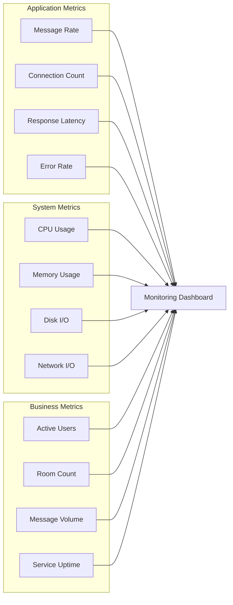

## Deployment Architecture

### Development Environment

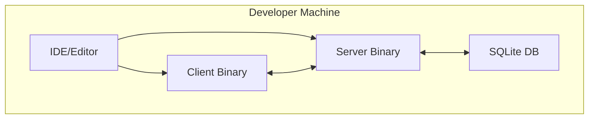

### Production Environment

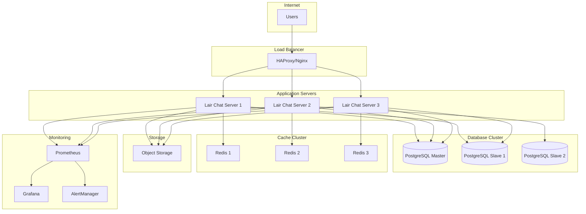

### Container Architecture

```dockerfile
# Multi-stage build for optimal image size
FROM rust:1.70 as builder
WORKDIR /app
COPY . .
RUN cargo build --release

FROM debian:bookworm-slim
RUN apt-get update && apt-get install -y ca-certificates
COPY --from=builder /app/target/release/lair-chat-server /usr/local/bin/
EXPOSE 8080
CMD ["lair-chat-server"]
```

### Kubernetes Deployment

```yaml
apiVersion: apps/v1
kind: Deployment
metadata:
  name: lair-chat-server
spec:
  replicas: 3
  selector:
    matchLabels:
      app: lair-chat-server
  template:
    metadata:
      labels:
        app: lair-chat-server
    spec:
      containers:
      - name: server
        image: lair-chat:latest
        ports:
        - containerPort: 8080
        env:
        - name: DATABASE_URL
          valueFrom:
            secretKeyRef:
              name: db-credentials
              key: url
        resources:
          requests:
            memory: "128Mi"
            cpu: "100m"
          limits:
            memory: "512Mi"
            cpu: "500m"
```

---

## Future Architecture Considerations

### Planned Enhancements

1. **Microservices Architecture**
   - Separate authentication service
   - Dedicated message routing service
   - Independent scaling per service

2. **Event-Driven Architecture**
   - Event sourcing for message history
   - CQRS for read/write separation
   - Event streaming with Apache Kafka

3. **Multi-Region Deployment**
   - Geographic distribution
   - Data replication strategies
   - Conflict resolution mechanisms

4. **Advanced Features**
   - Voice/video calling integration
   - File sharing and storage
   - Plugin architecture
   - Mobile client support

### Technology Evolution

- **WebAssembly**: For client-side plugins
- **gRPC**: For high-performance service communication
- **GraphQL**: For flexible API queries
- **Kubernetes**: For container orchestration
- **Service Mesh**: For advanced networking and security

This architecture documentation provides a comprehensive overview of the current system design and serves as a foundation for future development and scaling decisions.

---

*Architecture documentation last updated: June 2025*