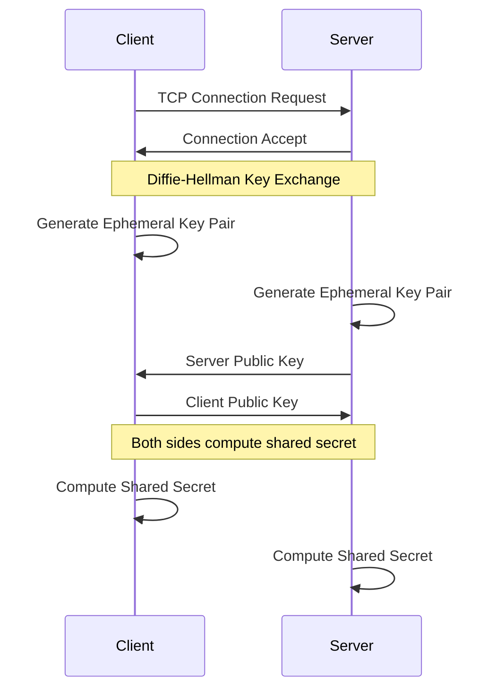
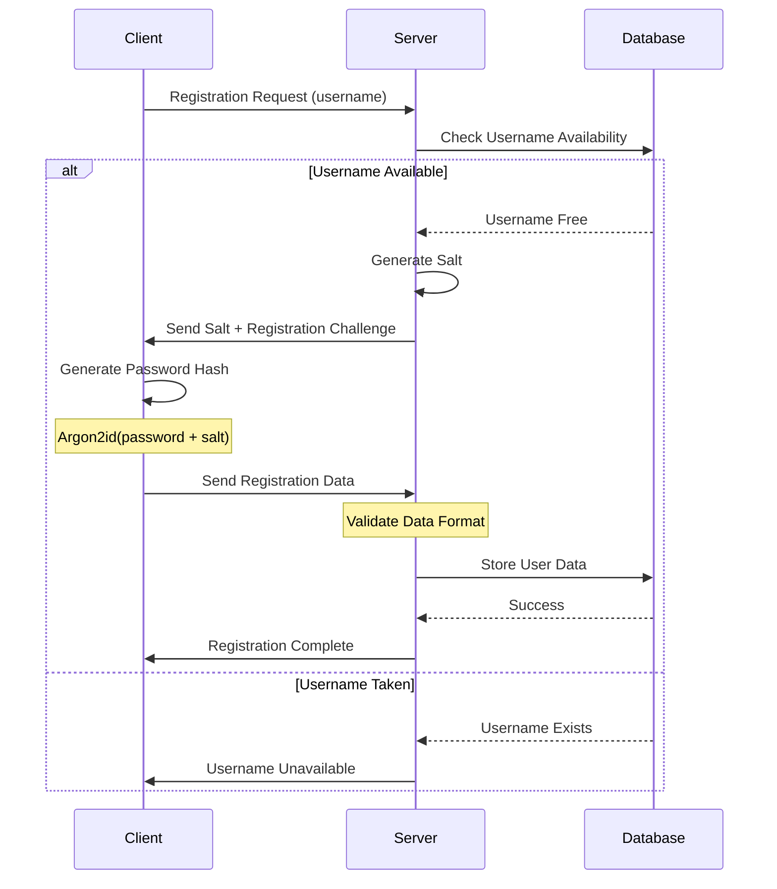
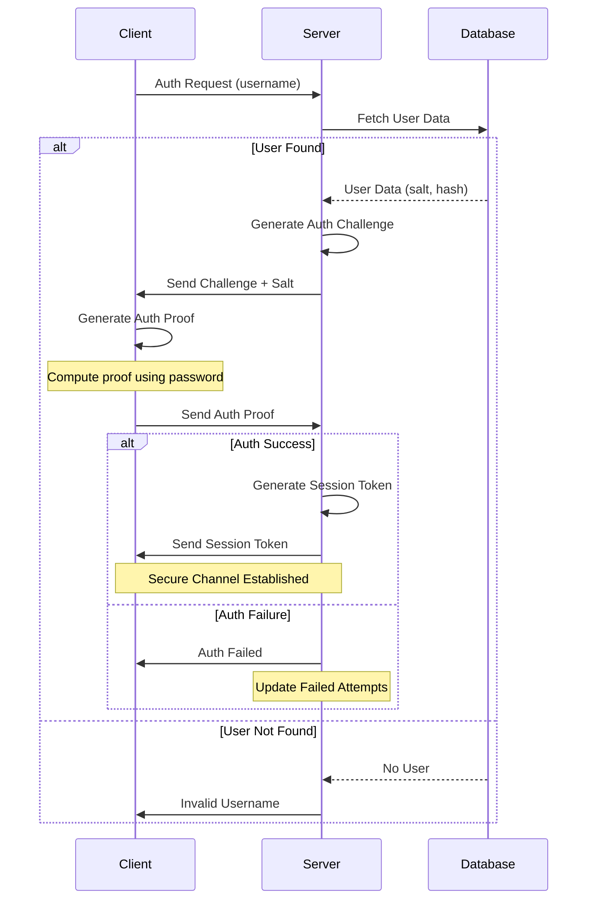
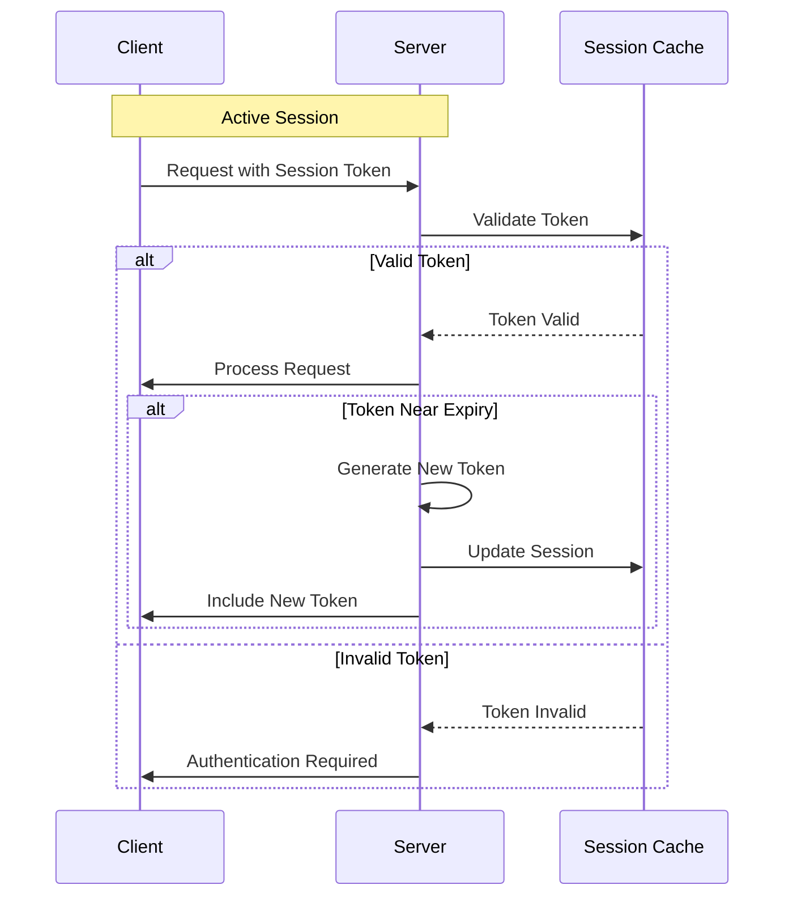
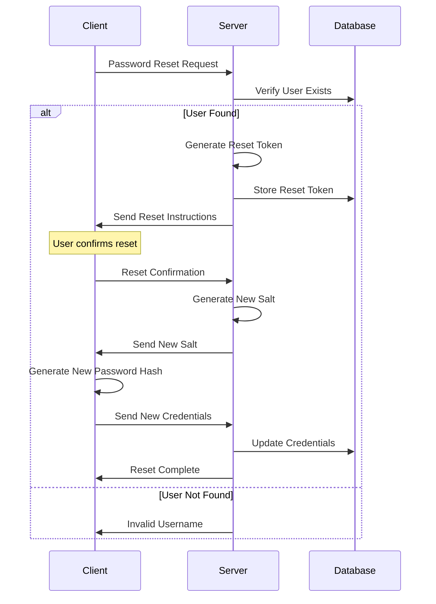
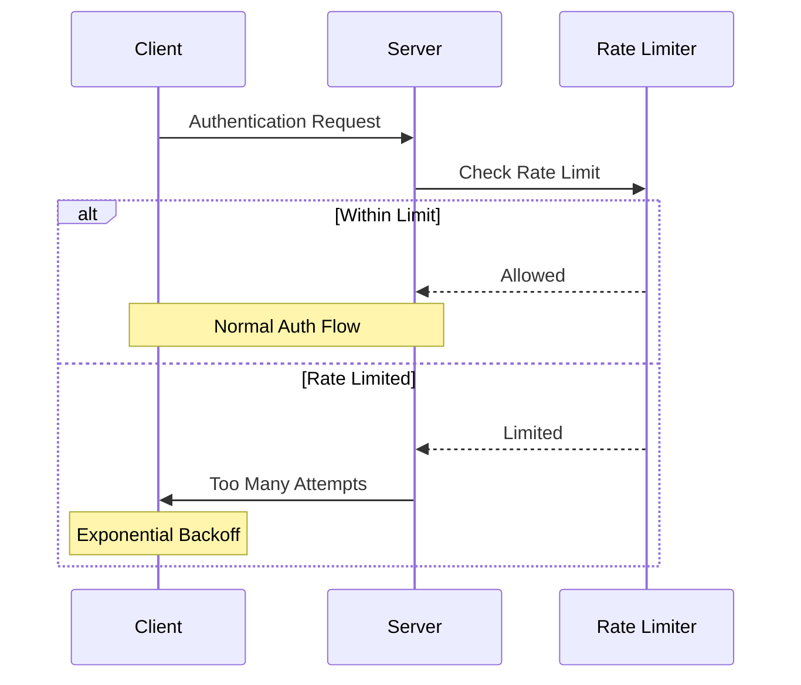

# Authentication Sequence Details

## 1. Initial Connection and Key Exchange



## 2. User Registration



## 3. User Authentication



## 4. Session Management



## 5. Password Reset Flow



## 6. Rate Limiting



## Technical Details

### Authentication Proof Generation

```rust
struct AuthProof {
    username: String,
    timestamp: u64,
    nonce: [u8; 32],
    proof: [u8; 32],
}

impl AuthProof {
    fn generate(
        username: &str,
        password: &str,
        salt: &[u8],
        challenge: &Challenge
    ) -> Self {
        let timestamp = SystemTime::now()
            .duration_since(UNIX_EPOCH)
            .unwrap()
            .as_secs();
            
        let nonce = rand::thread_rng()
            .gen::<[u8; 32]>();
            
        let proof = argon2::hash_password(
            password.as_bytes(),
            salt,
            &argon2::Config::default()
        );
        
        Self {
            username: username.to_string(),
            timestamp,
            nonce,
            proof: proof.unwrap(),
        }
    }
}
```

### Session Token Structure

```rust
struct SessionToken {
    // Token ID
    id: Uuid,
    
    // User information
    user_id: Uuid,
    username: String,
    
    // Timing information
    issued_at: DateTime<Utc>,
    expires_at: DateTime<Utc>,
    
    // Security metadata
    fingerprint: String,
    permissions: Vec<Permission>,
    
    // Cryptographic proof
    signature: [u8; 64],
}
```

### Rate Limiting Configuration

```rust
struct RateLimitConfig {
    // Window size in seconds
    window_size: u64,
    
    // Maximum attempts per window
    max_attempts: u32,
    
    // Backoff multiplier for consecutive failures
    backoff_multiplier: f64,
    
    // Maximum backoff time in seconds
    max_backoff: u64,
    
    // Separate limits for different operations
    limits: HashMap<Operation, RateLimit>,
}
```

## Error Handling

| Error Code | Description | Action |
|------------|-------------|---------|
| AUTH001 | Invalid Credentials | Increment failed attempts |
| AUTH002 | Rate Limited | Apply backoff |
| AUTH003 | Account Locked | Require recovery |
| AUTH004 | Session Expired | Request reauthentication |
| AUTH005 | Invalid Token | Clear session |
| AUTH006 | Server Error | Retry with backoff |

## Security Considerations

1. **Timing Attacks**
   - Use constant-time comparisons
   - Add random delays
   - Normalize response times

2. **Replay Protection**
   - Include timestamps in proofs
   - Use unique nonces
   - Maintain nonce history

3. **Session Security**
   - Rotate tokens regularly
   - Validate client fingerprints
   - Monitor for suspicious activity

4. **Data Protection**
   - Encrypt sensitive data
   - Use secure key storage
   - Implement secure erasure