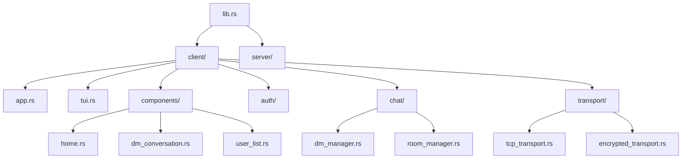
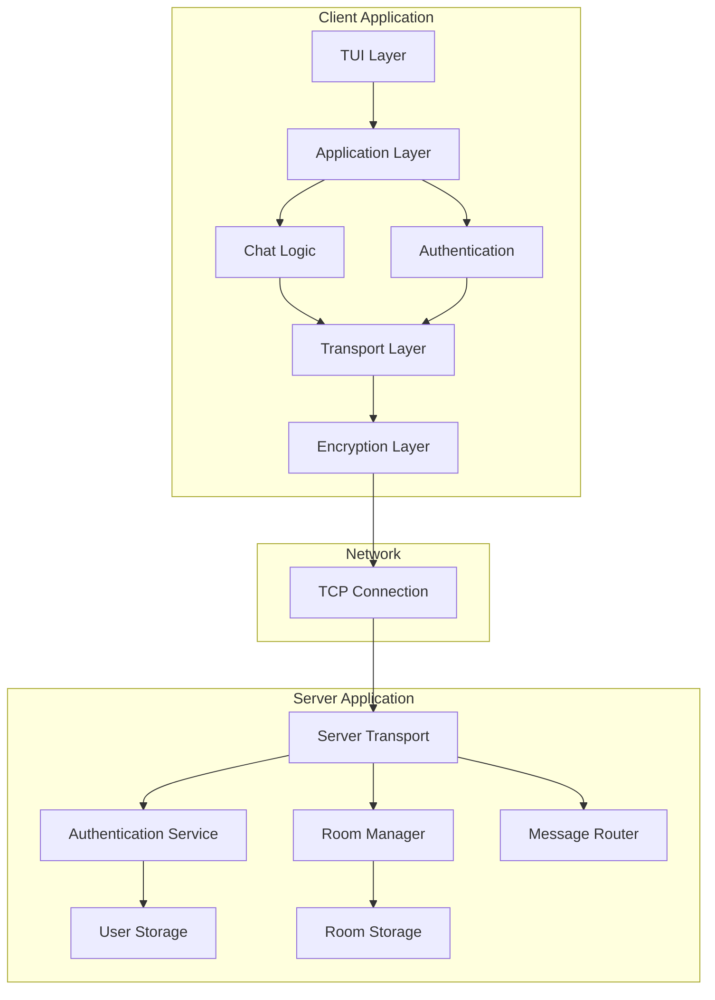
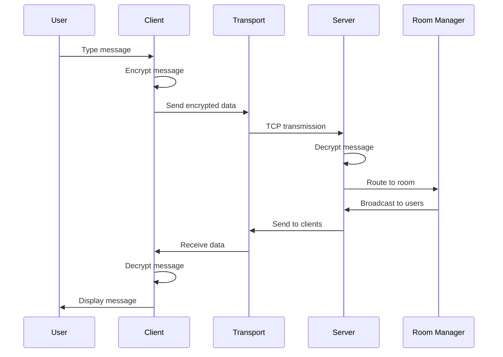

# Lair Chat Development Guide

A comprehensive guide for developers contributing to Lair Chat, covering setup, architecture, testing, and contribution workflows.

## Table of Contents

1. [Development Environment Setup](#development-environment-setup)
2. [Project Structure](#project-structure)
3. [Architecture Overview](#architecture-overview)
4. [Building and Running](#building-and-running)
5. [Testing Strategy](#testing-strategy)
6. [Code Standards](#code-standards)
7. [Contributing Guidelines](#contributing-guidelines)
8. [Debugging and Profiling](#debugging-and-profiling)
9. [Release Process](#release-process)
10. [Advanced Topics](#advanced-topics)

## Development Environment Setup

### Prerequisites

- **Rust**: 1.75.0 or later (MSRV as of June 2025)
- **Git**: For version control
- **Terminal**: Modern terminal with Unicode support
- **Editor**: VS Code, Vim, or your preferred Rust-compatible editor

### Rust Installation

```bash
# Install rustup (if not already installed)
curl --proto '=https' --tlsv1.2 -sSf https://sh.rustup.rs | sh

# Install the required toolchain (minimum 1.75.0 as of June 2025)
rustup toolchain install stable
rustup default stable

# Install useful components
rustup component add clippy rustfmt rust-analyzer
```

### Development Tools

```bash
# Install additional cargo tools
cargo install cargo-watch    # Auto-rebuild on file changes
cargo install cargo-audit    # Security vulnerability scanning
cargo install cargo-outdated # Check for outdated dependencies
cargo install cargo-bloat    # Binary size analysis
cargo install flamegraph     # Performance profiling
```

### Clone and Setup

```bash
# Clone the repository
git clone https://github.com/yourusername/lair-chat.git
cd lair-chat

# Verify setup
cargo check
cargo test
```

### Editor Configuration

#### VS Code
Install these extensions:
- rust-analyzer
- CodeLLDB (for debugging)
- Better TOML
- GitLens

#### Vim/Neovim
```vim
" Add to your config
Plug 'rust-lang/rust.vim'
Plug 'neoclide/coc.nvim', {'branch': 'release'}
```

## Project Structure

```
lair-chat/
├── src/
│   ├── client/              # Client-side code
│   │   ├── main.rs         # Client binary entry point
│   │   ├── app.rs          # Main application logic
│   │   ├── tui.rs          # Terminal UI framework
│   │   ├── components/     # UI components
│   │   ├── auth/           # Authentication handling
│   │   ├── chat/           # Chat functionality
│   │   └── transport/      # Network transport layer
│   ├── server/             # Server-side code
│   │   ├── main.rs         # Server binary entry point
│   │   └── auth/           # Server authentication
│   └── lib.rs              # Library exports
├── tests/                  # Integration tests
├── benches/                # Benchmarks
├── examples/               # Example code
├── docs/                   # Documentation
│   ├── api/               # API documentation
│   ├── guides/            # User and developer guides
│   ├── architecture/      # Architecture documents
│   └── development/       # Development docs
├── Cargo.toml              # Project configuration
├── Cargo.lock              # Dependency lock file
├── build.rs                # Build script
└── README.md               # Project overview
```

### Module Organization



## Architecture Overview

### High-Level Architecture



### Core Components

#### Client Architecture

1. **TUI Layer** (`tui.rs`):
   - Terminal User Interface using Ratatui
   - Event handling and rendering
   - Keyboard input processing

2. **Application Layer** (`app.rs`):
   - Main application state management
   - Coordination between components
   - Configuration handling

3. **Chat Logic** (`chat/`):
   - Message handling and storage
   - Room and DM management
   - User presence tracking

4. **Transport Layer** (`transport/`):
   - Network communication abstractions
   - Connection management
   - Message serialization

5. **Encryption Layer**:
   - End-to-end encryption with AES-GCM
   - Key exchange using X25519
   - Secure message transport

#### Server Architecture

1. **Connection Handler**:
   - TCP connection management
   - Client session handling
   - Message routing

2. **Authentication Service**:
   - User authentication and registration
   - Session management
   - Rate limiting

3. **Room Manager**:
   - Chat room creation and management
   - User permissions
   - Message broadcasting

### Data Flow



## Building and Running

### Development Builds

```bash
# Quick development build
cargo build

# Build with optimizations (slower build, faster runtime)
cargo build --release

# Build specific binary
cargo build --bin lair-chat-client
cargo build --bin lair-chat-server
```

### Running in Development

#### Terminal 1 - Server
```bash
# Run server with debug logging
RUST_LOG=debug cargo run --bin lair-chat-server

# Run with specific configuration
cargo run --bin lair-chat-server -- --config server.toml
```

#### Terminal 2 - Client
```bash
# Run client with debug logging
RUST_LOG=debug cargo run --bin lair-chat-client

# Connect to specific server
cargo run --bin lair-chat-client -- --server localhost:8080
```

### Watch Mode for Development

```bash
# Auto-rebuild and run on file changes
cargo watch -x "run --bin lair-chat-client"

# Run tests on changes
cargo watch -x test

# Run clippy on changes
cargo watch -x clippy
```

### Environment Variables

```bash
# Logging configuration
export RUST_LOG=debug                    # Enable debug logging
export RUST_LOG=lair_chat=trace         # Trace level for our crate
export RUST_LOG=error                    # Only errors

# Client configuration
export LAIR_CHAT_SERVER=localhost:8080  # Default server
export LAIR_CHAT_CONFIG=~/.config/lair-chat/client.toml

# Server configuration
export LAIR_CHAT_PORT=8080              # Server port
export LAIR_CHAT_HOST=0.0.0.0           # Bind address
```

## Testing Strategy

### Test Organization

```
tests/
├── integration/           # Integration tests
│   ├── client_server.rs  # Full client-server tests
│   ├── encryption.rs     # Encryption integration
│   └── transport.rs      # Transport layer tests
├── unit/                 # Unit tests (in src/)
└── fixtures/             # Test data and helpers
```

### Running Tests

```bash
# Run all tests
cargo test

# Run specific test
cargo test test_message_encryption

# Run with output
cargo test -- --nocapture

# Run integration tests only
cargo test --test integration

# Run with coverage (requires cargo-tarpaulin)
cargo tarpaulin --out Html
```

### Test Categories

#### Unit Tests
Located in source files using `#[cfg(test)]`:
```rust
#[cfg(test)]
mod tests {
    use super::*;
    
    #[test]
    fn test_message_creation() {
        let msg = Message::new("test", "Hello");
        assert_eq!(msg.content, "Hello");
    }
    
    #[tokio::test]
    async fn test_async_function() {
        let result = some_async_function().await;
        assert!(result.is_ok());
    }
}
```

#### Integration Tests
Full application testing:
```rust
#[tokio::test]
async fn test_client_server_communication() {
    let server = start_test_server().await;
    let client = TestClient::connect(&server.address()).await?;
    
    client.send_message("Hello, World!").await?;
    let received = server.get_last_message().await?;
    
    assert_eq!(received.content, "Hello, World!");
}
```

#### Property-Based Testing
Using the `proptest` crate:
```rust
use proptest::prelude::*;

proptest! {
    #[test]
    fn test_message_serialization(content in ".*") {
        let msg = Message::new("user", &content);
        let serialized = msg.serialize();
        let deserialized = Message::deserialize(&serialized)?;
        prop_assert_eq!(msg.content, deserialized.content);
    }
}
```

### Test Fixtures and Helpers

```rust
// tests/fixtures/mod.rs
pub struct TestServer {
    handle: JoinHandle<()>,
    address: SocketAddr,
}

impl TestServer {
    pub async fn start() -> Self {
        // Start test server
    }
    
    pub fn address(&self) -> SocketAddr {
        self.address
    }
}

pub struct TestClient {
    transport: TestTransport,
}

impl TestClient {
    pub async fn connect(addr: &SocketAddr) -> Result<Self> {
        // Connect test client
    }
}
```

## Code Standards

### Rust Style Guidelines

We follow the official Rust style guide with some additions:

#### Formatting
```bash
# Format code
cargo fmt

# Check formatting
cargo fmt -- --check
```

#### Linting
```bash
# Run clippy
cargo clippy

# Run clippy with all features
cargo clippy --all-features

# Deny warnings in CI
cargo clippy -- -D warnings
```

#### Code Organization

1. **Import Order**:
   ```rust
   // Standard library
   use std::collections::HashMap;
   use std::sync::Arc;
   
   // External crates
   use serde::{Deserialize, Serialize};
   use tokio::sync::Mutex;
   
   // Internal crates (crate-level)
   use crate::transport::Transport;
   use crate::errors::ChatError;
   
   // Local modules
   use super::message::Message;
   ```

2. **Error Handling**:
   ```rust
   // Use thiserror for error types
   #[derive(thiserror::Error, Debug)]
   pub enum ChatError {
       #[error("Connection failed: {0}")]
       ConnectionFailed(String),
       
       #[error("Authentication failed")]
       AuthenticationFailed,
   }
   
   // Use Result types consistently
   pub async fn send_message(&mut self, msg: Message) -> Result<(), ChatError> {
       // Implementation
   }
   ```

3. **Documentation**:
   ```rust
   /// Represents a chat message with metadata
   /// 
   /// # Examples
   /// 
   /// ```
   /// use lair_chat::Message;
   /// 
   /// let msg = Message::new("alice", "Hello, world!");
   /// assert_eq!(msg.author, "alice");
   /// ```
   pub struct Message {
       /// The username of the message author
       pub author: String,
       /// The message content
       pub content: String,
       /// When the message was created
       pub timestamp: chrono::DateTime<chrono::Utc>,
   }
   ```

### Async Guidelines

1. **Use `tokio` for async runtime**
2. **Prefer `async/await` over manual Future implementation**
3. **Use appropriate async primitives**:
   ```rust
   // For shared mutable state
   use tokio::sync::Mutex;
   
   // For channels
   use tokio::sync::mpsc;
   
   // For cancellation
   use tokio_util::sync::CancellationToken;
   ```

### Performance Guidelines

1. **Avoid unnecessary allocations**:
   ```rust
   // Good: Use string slices when possible
   fn process_message(content: &str) -> Result<()> {
       // ...
   }
   
   // Avoid: Unnecessary String allocation
   fn process_message(content: String) -> Result<()> {
       // ...
   }
   ```

2. **Use appropriate data structures**:
   ```rust
   // For frequent insertions/removals
   use std::collections::HashMap;
   
   // For ordered data
   use std::collections::BTreeMap;
   
   // For message queues
   use std::collections::VecDeque;
   ```

## Contributing Guidelines

### Workflow

1. **Fork the repository**
2. **Create a feature branch**:
   ```bash
   git checkout -b feature/new-awesome-feature
   ```
3. **Make your changes**
4. **Write tests**
5. **Ensure all tests pass**:
   ```bash
   cargo test
   cargo clippy
   cargo fmt --check
   ```
6. **Submit a pull request**

### Commit Messages

Follow [Conventional Commits](https://www.conventionalcommits.org/):

```
feat: add support for file attachments in DMs
fix: resolve connection timeout issues
docs: update API documentation for transport layer
test: add integration tests for encryption
refactor: simplify message routing logic
perf: optimize message serialization
```

### Pull Request Guidelines

1. **Title**: Clear, descriptive title
2. **Description**: 
   - What changes were made
   - Why the changes were necessary
   - Any breaking changes
   - Testing notes
3. **Checklist**:
   - [ ] Tests added/updated
   - [ ] Documentation updated
   - [ ] No linting errors
   - [ ] All tests pass

### Code Review Process

1. **Automated checks** must pass
2. **At least one review** from a maintainer
3. **Address feedback** promptly
4. **Squash commits** before merging (if requested)

## Debugging and Profiling

### Logging

```rust
use tracing::{debug, error, info, warn, trace};

// Use structured logging
info!(user = %username, room = %room_name, "User joined room");

// Use different levels appropriately
trace!("Detailed execution flow");
debug!("Debugging information"); 
info!("General information");
warn!("Something unexpected happened");
error!(error = %err, "Operation failed");
```

### Debug Configuration

```toml
# Cargo.toml - Debug profile
[profile.dev]
debug = true
opt-level = 0

# Release profile with debug info
[profile.release-with-debug]
inherits = "release"
debug = true
```

### Debugging Tools

#### GDB/LLDB
```bash
# Build with debug symbols
cargo build

# Debug with gdb
rust-gdb target/debug/lair-chat-client

# Debug with lldb
rust-lldb target/debug/lair-chat-client
```

#### VS Code Debugging
```json
// .vscode/launch.json
{
    "version": "0.2.0",
    "configurations": [
        {
            "type": "lldb",
            "request": "launch",
            "name": "Debug Client",
            "cargo": {
                "args": ["build", "--bin=lair-chat-client"],
                "filter": {
                    "name": "lair-chat-client",
                    "kind": "bin"
                }
            },
            "args": [],
            "cwd": "${workspaceFolder}"
        }
    ]
}
```

### Performance Profiling

#### CPU Profiling with Flamegraph
```bash
# Install flamegraph
cargo install flamegraph

# Profile the application
cargo flamegraph --bin lair-chat-client

# Open flamegraph.svg in browser
```

#### Memory Profiling with Valgrind
```bash
# Install valgrind
sudo apt install valgrind  # Ubuntu/Debian

# Run with valgrind
valgrind --tool=memcheck --leak-check=full target/debug/lair-chat-client
```

#### Benchmarking
```bash
# Run benchmarks
cargo bench

# Run specific benchmark
cargo bench message_throughput

# Generate benchmark report
cargo bench -- --save-baseline main
```

## Release Process

### Version Management

We use [Semantic Versioning](https://semver.org/):
- **MAJOR**: Breaking changes
- **MINOR**: New features, backwards compatible
- **PATCH**: Bug fixes, backwards compatible

### Release Checklist

1. **Update version numbers**:
   ```bash
   # Update Cargo.toml
   version = "0.7.0"
   
   # Update README.md badges
   # Update documentation
   ```

2. **Update changelog**:
   ```markdown
   # Changelog
   
   ## [0.7.0] - 2024-01-15
   
   ### Added
   - File attachment support in DMs
   - Message reactions
   
   ### Changed
   - Improved encryption performance
   
   ### Fixed
   - Connection stability issues
   ```

3. **Create release**:
   ```bash
   git tag -a v0.7.0 -m "Release version 0.7.0"
   git push origin v0.7.0
   ```

4. **Build release artifacts**:
   ```bash
   # Build for different targets
   cargo build --release --target x86_64-unknown-linux-gnu
   cargo build --release --target x86_64-pc-windows-gnu
   cargo build --release --target x86_64-apple-darwin
   ```

5. **Publish to crates.io**:
   ```bash
   cargo publish --dry-run
   cargo publish
   ```

### CI/CD Pipeline

Our GitHub Actions workflow includes:

```yaml
# .github/workflows/ci.yml
name: CI

on: [push, pull_request]

jobs:
  test:
    runs-on: ubuntu-latest
    steps:
      - uses: actions/checkout@v2
      - uses: actions-rs/toolchain@v1
        with:
          toolchain: stable
      - name: Run tests
        run: cargo test --all-features
      - name: Run clippy
        run: cargo clippy -- -D warnings
      - name: Check formatting
        run: cargo fmt -- --check
  
  security:
    runs-on: ubuntu-latest
    steps:
      - uses: actions/checkout@v2
      - name: Security audit
        run: cargo audit
```

## Advanced Topics

### Custom Transport Implementation

To implement a custom transport layer:

```rust
use async_trait::async_trait;
use crate::transport::{Transport, TransportError};

pub struct MyCustomTransport {
    // Implementation details
}

#[async_trait]
impl Transport for MyCustomTransport {
    async fn send(&mut self, data: &[u8]) -> Result<(), TransportError> {
        // Send implementation
    }
    
    async fn receive(&mut self) -> Result<Vec<u8>, TransportError> {
        // Receive implementation
    }
    
    async fn close(&mut self) -> Result<(), TransportError> {
        // Cleanup implementation
    }
}
```

### Encryption Extensions

Adding new encryption algorithms:

```rust
use crate::encryption::{EncryptionService, EncryptionError};

pub struct MyEncryption {
    // Encryption state
}

impl EncryptionService for MyEncryption {
    fn encrypt(&self, data: &[u8]) -> Result<Vec<u8>, EncryptionError> {
        // Encryption implementation
    }
    
    fn decrypt(&self, data: &[u8]) -> Result<Vec<u8>, EncryptionError> {
        // Decryption implementation
    }
}
```

### Plugin Architecture

Future plugin support framework:

```rust
pub trait Plugin: Send + Sync {
    fn name(&self) -> &str;
    fn version(&self) -> &str;
    
    fn on_message(&self, message: &Message) -> Result<(), PluginError>;
    fn on_user_join(&self, user: &User) -> Result<(), PluginError>;
}

pub struct PluginManager {
    plugins: Vec<Box<dyn Plugin>>,
}

impl PluginManager {
    pub fn register_plugin(&mut self, plugin: Box<dyn Plugin>) {
        self.plugins.push(plugin);
    }
}
```

---

## Resources

- [Rust Book](https://doc.rust-lang.org/book/)
- [Tokio Tutorial](https://tokio.rs/tokio/tutorial)
- [Ratatui Documentation](https://ratatui.rs/)
- [Cargo Book](https://doc.rust-lang.org/cargo/)
- [API Documentation](../api/README.md)
- [Architecture Documentation](../architecture/README.md)

For questions or support, please open an issue or join our development chat room.

---

*Development Guide last updated: June 2025*