# GitHub CI/CD Guide for Lair-Chat

**Version**: 1.0  
**Last Updated**: June 2025  
**Audience**: Contributors, Maintainers, DevOps Engineers

## Table of Contents

1. [Overview](#overview)
2. [Workflow Structure](#workflow-structure)
3. [Job Descriptions](#job-descriptions)
4. [Triggers and Conditions](#triggers-and-conditions)
5. [Environment Configuration](#environment-configuration)
6. [Development Workflow](#development-workflow)
7. [Troubleshooting](#troubleshooting)
8. [Performance Optimization](#performance-optimization)
9. [Security Considerations](#security-considerations)
10. [Future Enhancements](#future-enhancements)

## Overview

The Lair-Chat project uses GitHub Actions for Continuous Integration (CI) to ensure code quality, security, and reliability. The CI pipeline is designed to be development-friendly while maintaining high standards for production releases.

### Design Principles

- **Developer-Friendly**: Non-blocking warnings during active development
- **Comprehensive**: Multiple validation layers including format, lint, test, build, and security
- **Efficient**: Smart caching and conditional execution to minimize resource usage
- **Reliable**: Proper error handling and fallback strategies
- **Scalable**: Matrix testing across multiple Rust versions

## Workflow Structure

The CI system consists of **6 parallel jobs** that run automatically:

```mermaid
graph TD
    A[Push/PR Trigger] --> B[format_and_lint]
    A --> C[test]
    A --> D[build_binaries]
    A --> E[benchmarks]
    A --> F[coverage]
    A --> G[security_audit]
    A --> H[check_docs]
    
    B --> I[✅ Format Check]
    B --> J[⚠️ Clippy Warnings]
    
    C --> K[📦 Build All Targets]
    C --> L[🧪 Library Tests]
    C --> M[🔗 Integration Tests]
    C --> N[📚 Doc Tests]
    
    D --> O[🎯 Client Binary]
    D --> P[🖥️ Server Binary]
    D --> Q[🚀 Release Build]
```



## Job Descriptions

### 1. 🎨 Format and Lint (`format_and_lint`)

**Purpose**: Ensures code style consistency and catches common issues.

**Steps**:
- **Code Formatting**: `cargo fmt --all -- --check` (blocking)
- **Linting**: `cargo clippy --all-targets --all-features` (non-blocking warnings)

**Runtime**: ~2-3 minutes

**Blocking**: Only formatting failures block the pipeline

```yaml
- name: Check formatting
  run: cargo fmt --all -- --check

- name: Run clippy (warnings allowed during development)
  run: cargo clippy --all-targets --all-features -- -W clippy::all
  continue-on-error: true
```

### 2. 🧪 Test Suite (`test`)

**Purpose**: Validates functionality across multiple Rust versions.

**Matrix Strategy**:
- **Rust Versions**: `stable`, `beta`
- **Test Types**: Library, Integration, Documentation

**Steps**:
1. **Build Verification**: `cargo build --all-targets --verbose`
2. **Library Tests**: `cargo test --lib --verbose`
3. **Integration Tests**: `cargo test --test '*' --verbose`
4. **Documentation Tests**: `cargo test --doc --verbose`

**Runtime**: ~5-8 minutes per matrix job

```yaml
strategy:
  matrix:
    rust: [stable, beta]
```

### 3. 🏗️ Build Binaries (`build_binaries`)

**Purpose**: Verifies that both client and server binaries build successfully.

**Targets**:
- **Client Binary**: `lair-chat-client`
- **Server Binary**: `lair-chat-server`
- **Release Build**: Optimized production binaries

**Steps**:
```yaml
- name: Build client binary
  run: cargo build --bin lair-chat-client --verbose

- name: Build server binary
  run: cargo build --bin lair-chat-server --verbose

- name: Build release binaries
  run: cargo build --release --verbose
```

**Runtime**: ~3-5 minutes

### 4. 🏃 Benchmarks (`benchmarks`)

**Purpose**: Performance regression detection for main branch.

**Conditional Execution**: Only runs on pushes to `main` branch

**Benchmarks**:
- Connection performance
- Message throughput
- Transport layer efficiency

**Runtime**: ~10-15 minutes

```yaml
if: github.event_name == 'push' && github.ref == 'refs/heads/main'
```

### 5. 📊 Code Coverage (`coverage`)

**Purpose**: Tracks test coverage metrics using `cargo-tarpaulin`.

**Conditional Execution**: Only runs on pushes to `main` branch

**Features**:
- **Coverage Analysis**: All features and workspace coverage
- **Codecov Integration**: Automatic upload to codecov.io
- **Non-blocking**: Failures don't block merges

**Runtime**: ~8-12 minutes

```yaml
- name: Generate coverage report
  run: cargo tarpaulin --verbose --all-features --workspace --timeout 120 --out Xml
  continue-on-error: true
```

### 6. 🔒 Security Audit (`security_audit`)

**Purpose**: Scans for known security vulnerabilities in dependencies.

**Tool**: `cargo-audit`

**Features**:
- **Dependency Scanning**: Checks all dependencies against RustSec database
- **Non-blocking**: Warnings reported but don't fail CI
- **Regular Updates**: Runs on every commit

**Runtime**: ~1-2 minutes

### 7. 📚 Documentation Check (`check_docs`)

**Purpose**: Ensures documentation builds without warnings.

**Features**:
- **All Features**: Tests documentation for all feature combinations
- **Warning Treatment**: Documentation warnings treated as errors
- **Non-blocking**: Issues reported but don't block development

```yaml
env:
  RUSTDOCFLAGS: "-D warnings"
continue-on-error: true
```

## Triggers and Conditions

### Automatic Triggers

```yaml
on:
  push:
    branches: [main]
  pull_request:
    branches: [main]
```

### Conditional Job Execution

| Job | Condition | Reason |
|-----|-----------|---------|
| `format_and_lint` | Always | Code quality baseline |
| `test` | Always | Core functionality validation |
| `build_binaries` | Always | Build verification |
| `benchmarks` | Main branch only | Performance monitoring |
| `coverage` | Main branch only | Resource intensive |
| `security_audit` | Always | Security is critical |
| `check_docs` | Always | Documentation quality |

## Environment Configuration

### Global Environment Variables

```yaml
env:
  CARGO_TERM_COLOR: always    # Colored output for better readability
  RUST_BACKTRACE: 1          # Detailed error information
```

### Caching Strategy

**Rust Cache**: Uses `Swatinem/rust-cache@v2`
- **Dependencies**: Cached between runs
- **Build Artifacts**: Incremental compilation
- **Performance**: ~50% faster builds on cache hits

```yaml
- name: Rust Cache
  uses: Swatinem/rust-cache@v2
```

### Modern Toolchain

**Actions Used**:
- `actions/checkout@v4`: Latest checkout action
- `dtolnay/rust-toolchain@stable`: Modern Rust toolchain management

## Development Workflow

### For Contributors

1. **Local Development**:
   ```bash
   # Check formatting before push
   cargo fmt --all
   
   # Run clippy locally
   cargo clippy --all-targets --all-features
   
   # Run tests
   cargo test
   ```

2. **Pull Request Process**:
   - All jobs run automatically
   - Only formatting failures block merges
   - Clippy warnings are reported but don't block
   - Review CI results and address critical issues

3. **Main Branch**:
   - Additional jobs run (benchmarks, coverage)
   - Performance metrics tracked
   - Coverage reports generated

### For Maintainers

1. **Monitoring**:
   - Review benchmark trends
   - Monitor coverage changes
   - Address security audit findings

2. **Configuration Updates**:
   - Adjust job conditions as needed
   - Update Rust versions in matrix
   - Modify warning treatment for stable releases

## Troubleshooting

### Common Issues

#### 1. Formatting Failures

**Symptom**: CI fails on format check
**Solution**:
```bash
cargo fmt --all
git add .
git commit -m "fix: Apply code formatting"
```

#### 2. Build Failures

**Symptom**: Compilation errors in CI
**Diagnosis**:
- Check for platform-specific issues
- Verify dependency compatibility
- Look for missing features

**Solution**:
```bash
# Test locally with same flags
cargo build --all-targets --verbose
```

#### 3. Test Failures

**Symptom**: Tests pass locally but fail in CI
**Common Causes**:
- Race conditions
- Environment differences
- Resource constraints

**Debugging**:
```bash
# Run tests with backtrace
RUST_BACKTRACE=1 cargo test
```

#### 4. Cache Issues

**Symptom**: Unexpected build times or failures
**Solution**: Clear cache by creating new PR or pushing empty commit

### Debug Techniques

1. **Enable Debug Logging**:
   ```yaml
   - name: Debug step
     run: |
       echo "Debug information"
       cargo --version
       rustc --version
   ```

2. **Matrix Debugging**:
   ```yaml
   - name: Show matrix info
     run: echo "Running on Rust ${{ matrix.rust }}"
   ```

## Performance Optimization

### Current Optimizations

1. **Parallel Execution**: All jobs run concurrently
2. **Smart Caching**: Rust dependencies and build artifacts cached
3. **Conditional Execution**: Expensive jobs only on main branch
4. **Matrix Strategy**: Test multiple Rust versions efficiently

### Metrics

| Job | Typical Runtime | Resource Usage |
|-----|----------------|----------------|
| Format/Lint | 2-3 min | Low |
| Test (per matrix) | 5-8 min | Medium |
| Build Binaries | 3-5 min | Medium |
| Benchmarks | 10-15 min | High |
| Coverage | 8-12 min | High |
| Security Audit | 1-2 min | Low |
| Documentation | 2-4 min | Low |

### Future Optimizations

1. **Incremental Testing**: Only test changed components
2. **Build Artifact Sharing**: Share binaries between jobs
3. **Custom Runners**: Self-hosted runners for performance-critical jobs
4. **Dependency Caching**: More granular dependency management

## Security Considerations

### Current Security Measures

1. **Dependency Scanning**: `cargo audit` on every commit
2. **Limited Permissions**: Jobs run with minimal required permissions
3. **No Secret Exposure**: No secrets used in public repositories
4. **Trusted Actions**: Only well-maintained GitHub Actions used

### Best Practices

1. **Pin Action Versions**: Use specific versions (e.g., `@v4`)
2. **Minimal Permissions**: Only grant necessary permissions
3. **Audit Dependencies**: Regular security audit reviews
4. **Environment Isolation**: Jobs run in isolated environments

## Future Enhancements

### Planned Improvements

1. **Release Automation**:
   ```yaml
   release:
     if: startsWith(github.ref, 'refs/tags/')
     steps:
       - name: Build release artifacts
       - name: Create GitHub release
       - name: Upload binaries
   ```

2. **Multi-Platform Builds**:
   ```yaml
   strategy:
     matrix:
       os: [ubuntu-latest, windows-latest, macos-latest]
   ```

3. **Integration Testing**:
   ```yaml
   integration:
     steps:
       - name: Start test server
       - name: Run client tests
       - name: End-to-end scenarios
   ```

4. **Performance Tracking**:
   - Benchmark result storage
   - Performance regression alerts
   - Historical trend analysis

### Monitoring and Alerting

1. **CI Health Metrics**:
   - Success rate tracking
   - Average runtime monitoring
   - Resource usage analysis

2. **Notification Strategy**:
   - Slack integration for failures
   - Email alerts for security issues
   - Dashboard for CI metrics

## Configuration Reference

### Complete Workflow File

The current CI configuration is located at:
```
.github/workflows/ci.yml
```

### Key Configuration Sections

```yaml
# Environment setup
env:
  CARGO_TERM_COLOR: always
  RUST_BACKTRACE: 1

# Job definitions
jobs:
  format_and_lint:    # Code quality
  test:              # Functionality
  build_binaries:    # Build verification
  benchmarks:        # Performance (main only)
  coverage:          # Test coverage (main only)
  security_audit:    # Security scanning
  check_docs:        # Documentation
```

## Conclusion

The Lair-Chat CI system provides comprehensive validation while remaining developer-friendly. The configuration balances thorough testing with practical development needs, ensuring high code quality without blocking productivity.

For questions or suggestions about the CI system, please open an issue or contact the maintainers.

---

**Maintenance Notes**:
- Review this document quarterly
- Update when CI configuration changes
- Sync with project roadmap and requirements
- Gather feedback from contributors regularly

**Related Documentation**:
- [Development Guide](DEVELOPMENT_GUIDE.md)
- [Contributing Guidelines](../CONTRIBUTING.md)
- [Testing Strategy](testing-strategy.md)
- [Release Process](../releases/RELEASE_PROCESS.md)