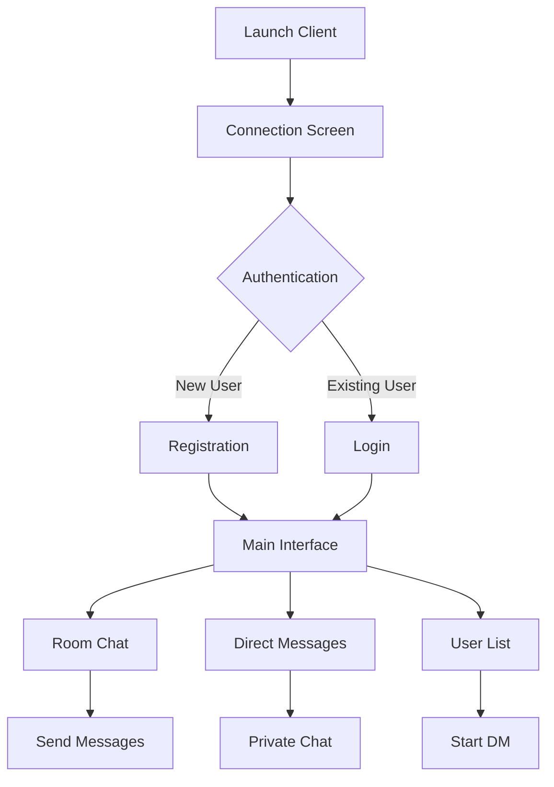
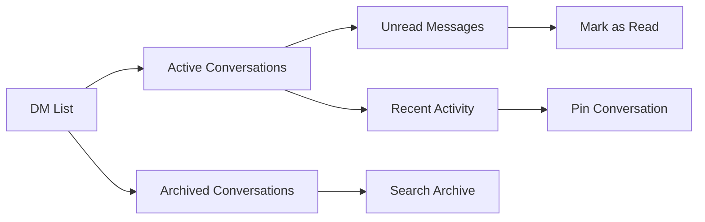
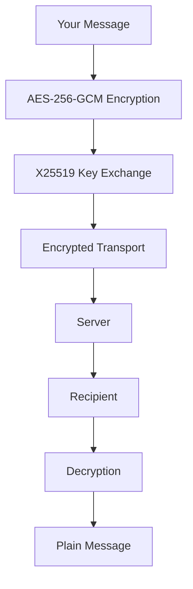
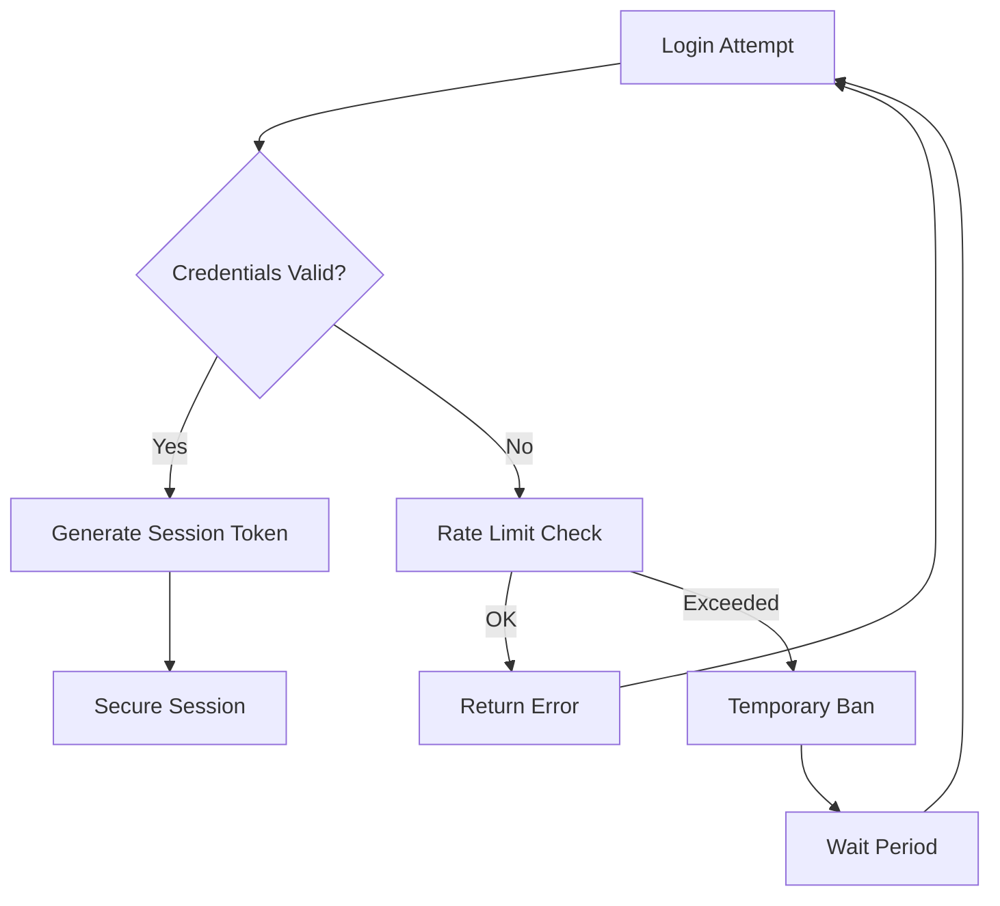

# Lair Chat User Guide

Welcome to Lair Chat! This comprehensive guide will help you get started and make the most of all features.

## Table of Contents

1. [Getting Started](#getting-started)
2. [Interface Overview](#interface-overview)
3. [Basic Chat Operations](#basic-chat-operations)
4. [Direct Messaging](#direct-messaging)
5. [Room Management](#room-management)
6. [Security Features](#security-features)
7. [Customization](#customization)
8. [Troubleshooting](#troubleshooting)
9. [Keyboard Shortcuts](#keyboard-shortcuts)

## Getting Started

### Prerequisites

- **Operating System**: Linux, macOS, or Windows
- **Terminal**: Modern terminal with Unicode support
- **Fonts**: [Nerd Fonts](https://www.nerdfonts.com/) recommended for best experience
- **Network**: TCP connectivity to chat server

### Installation

#### Option 1: From Source (Recommended)
```bash
git clone https://github.com/yourusername/lair-chat.git
cd lair-chat
cargo build --release
```

#### Option 2: Using Cargo
```bash
cargo install lair-chat
```

### First Launch

1. **Start the server** (if self-hosting):
   ```bash
   ./target/release/lair-chat-server
   ```

2. **Launch the client**:
   ```bash
   ./target/release/lair-chat-client
   ```

3. **Connect to server**:
   - Enter server address (default: localhost:8080)
   - Create account or login with existing credentials

## Interface Overview

```
┌────────────────────────────────────────────────────────────────────┐
│ Lair Chat v0.6.2 - Connected ●                          [Ctrl+Q] │
├─────────────────┬──────────────────────────────────────────────────┤
│   Rooms (3)     │                Main Chat                         │
│                 │                                                  │
│ 🏠 Lobby        │ [Alice]: Hey everyone! How's it going?          │
│ 💼 Work         │ [Bob]: Great! Working on the new project        │
│ 🎮 Gaming    ►  │ [You]: Sounds interesting, tell us more!        │
│                 │ [Alice]: It's a chat app built with Rust        │
│   Users (12)    │                                                  │
│                 │                                                  │
│ 🔴 Alice        │                                                  │
│ 🟢 Bob          │                                                  │
│ 🟡 Charlie      │                                                  │
│ 🔴 Diana        │                                                  │
│                 │                                                  │
│   DMs (2)       │                                                  │
│                 │                                                  │
│ 📧 Alice     2  │                                                  │
│ 📧 Bob          │                                                  │
├─────────────────┼──────────────────────────────────────────────────┤
│ Type message... │                                  [12:34:56] │
└─────────────────┴──────────────────────────────────────────────────┘
```

### Interface Components

1. **Title Bar**: Shows app version, connection status, and quit shortcut
2. **Left Panel**: Rooms, online users, and direct messages
3. **Main Panel**: Chat messages and conversation
4. **Input Field**: Message composition area
5. **Status Bar**: Current time and connection info

### Navigation Flow



## Basic Chat Operations

### Sending Messages

1. **Text Messages**:
   - Type your message in the input field
   - Press `Enter` to send
   - Use `Shift+Enter` for multi-line messages

2. **Message Formatting**:
   ```
   *bold text*          → **bold text**
   _italic text_        → *italic text*
   `code snippet`       → code snippet
   ```

3. **Special Commands**:
   ```
   /me does something   → * You does something
   /clear              → Clear chat history
   /help               → Show help information
   ```

### Message History

- **Scroll**: Use `↑/↓` arrows or `Page Up/Down`
- **Search**: Press `Ctrl+F` to search messages
- **Jump to**: `Ctrl+G` to jump to specific time/date

### Message Status Indicators

```
✓  Message sent
✓✓ Message delivered
✓✓ Message read (in DMs)
⚠️  Message failed
🔄 Message sending
```

## Direct Messaging

### Starting a Direct Message

1. **From User List**:
   - Navigate to Users panel (`Ctrl+U`)
   - Select user with `↑/↓` arrows
   - Press `Enter` or `D` to start DM

2. **From Chat**:
   - Click on username in chat
   - Select "Send Direct Message"

### DM Interface

```
┌─────────────────────────── Direct Message: Alice ───────────────────────────┐
│                                                                  [12:34] │
│                                                                            │
│ Alice: Hey! How are you doing?                               ✓✓ [11:30] │
│                                                                            │
│ You: I'm good, thanks! Just working on some code.           ✓✓ [11:32] │
│                                                                            │
│ Alice: Cool! What are you building?                         ✓✓ [11:33] │
│                                                                            │
│ You: A chat application actually! 😄                        ✓  [11:35] │
│                                                                            │
├────────────────────────────────────────────────────────────────────────────┤
│ Type your message...                                        [Ctrl+B] Back │
└────────────────────────────────────────────────────────────────────────────┘
```

### DM Features

- **Read Receipts**: See when messages are read
- **Typing Indicators**: Know when someone is typing
- **Message History**: Full conversation history
- **Unread Counters**: Track unread messages
- **Notifications**: Desktop notifications for new DMs

### Managing Conversations



## Room Management

### Joining Rooms

1. **Public Rooms**:
   - Browse available rooms in the Rooms panel
   - Select room and press `Enter`
   - No invitation required

2. **Private Rooms**:
   - Requires invitation from room moderator
   - Enter room code when prompted

### Room Types

| Icon | Type | Description |
|------|------|-------------|
| 🏠 | Lobby | Default public room |
| 💼 | Work | Professional discussions |
| 🎮 | Gaming | Gaming and entertainment |
| 🔒 | Private | Invitation-only rooms |
| 📢 | Announcements | Read-only for most users |

### Room Navigation

```
Rooms Panel:
┌─────────────────┐
│ 🏠 Lobby     45 │ ← Active users count
│ 💼 Work      12 │
│ 🎮 Gaming ►   8 │ ← Currently selected
│ 🔒 VIP        3 │
│ 📢 News       0 │
└─────────────────┘
```

### Room Commands

```bash
/join #room-name    # Join a room
/leave             # Leave current room
/who               # List room users
/topic new topic   # Set room topic (if permitted)
/invite @username  # Invite user to room
```

## Security Features

### Encryption Overview

Lair Chat uses military-grade encryption to protect your messages:



### Security Indicators

- **🔒 Encrypted**: End-to-end encryption active
- **🔓 Unencrypted**: Plain text communication
- **⚠️ Warning**: Potential security issue
- **✅ Verified**: Secure connection established

### Key Management

1. **Automatic Key Exchange**:
   - Keys are exchanged automatically on connection
   - No manual key management required
   - Perfect forward secrecy enabled

2. **Key Verification**:
   - Verify contact keys for enhanced security
   - Compare key fingerprints out-of-band
   - Report suspicious key changes

### Authentication



## Customization

### Theme Configuration

1. **Built-in Themes**:
   - Dark (default)
   - Light
   - High Contrast
   - Cyberpunk
   - Minimal

2. **Custom Themes**:
   ```bash
   # Edit config file
   ~/.config/lair-chat/config.toml
   
   [theme]
   name = "custom"
   primary_color = "#00ff00"
   secondary_color = "#ff0000"
   background = "#000000"
   ```

### Font Configuration

1. **Recommended Fonts**:
   - JetBrains Mono Nerd Font
   - Fira Code Nerd Font
   - Hack Nerd Font

2. **Font Testing**:
   ```bash
   lair-chat-client --test-fonts
   ```

### Keyboard Shortcuts

You can customize shortcuts in the config file:

```toml
[shortcuts]
quit = "Ctrl+Q"
new_dm = "Ctrl+D"
switch_room = "Ctrl+R"
user_list = "Ctrl+U"
```

## Troubleshooting

### Common Issues

#### Connection Problems

**Symptom**: Can't connect to server
**Solutions**:
1. Check network connectivity
2. Verify server address and port
3. Check firewall settings
4. Try different network/VPN

#### Display Issues

**Symptom**: Garbled characters or broken UI
**Solutions**:
1. Install a Nerd Font
2. Update terminal emulator
3. Check terminal size (minimum 80x24)
4. Verify Unicode support

#### Performance Issues

**Symptom**: Slow or laggy interface
**Solutions**:
1. Close other resource-intensive applications
2. Check system resources (CPU, RAM)
3. Reduce chat history length
4. Update to latest version

### Debug Mode

Enable debug logging for troubleshooting:

```bash
RUST_LOG=debug lair-chat-client
```

### Getting Help

1. **Built-in Help**: Press `F1` or type `/help`
2. **Documentation**: Visit [docs/](../README.md)
3. **Issues**: Report bugs on GitHub
4. **Community**: Join our chat server for support

### Log Files

- **Client logs**: `~/.local/share/lair-chat/client.log`
- **Debug logs**: `~/.local/share/lair-chat/debug.log`
- **Error logs**: `~/.local/share/lair-chat/error.log`

## Keyboard Shortcuts

### Global Shortcuts

| Shortcut | Action |
|----------|--------|
| `Ctrl+Q` | Quit application |
| `Ctrl+H` | Show/hide help |
| `F1` | Context help |
| `Ctrl+L` | Clear screen |

### Navigation

| Shortcut | Action |
|----------|--------|
| `Tab` | Switch between panels |
| `Ctrl+R` | Focus rooms list |
| `Ctrl+U` | Focus users list |
| `Ctrl+D` | Focus DM list |
| `Escape` | Return to main chat |

### Chat Operations

| Shortcut | Action |
|----------|--------|
| `Enter` | Send message |
| `Shift+Enter` | New line in message |
| `Ctrl+F` | Search messages |
| `Ctrl+G` | Go to timestamp |
| `Page Up/Down` | Scroll chat history |

### Direct Messages

| Shortcut | Action |
|----------|--------|
| `D` | Start DM (from user list) |
| `Ctrl+B` | Back to main chat |
| `Ctrl+N` | Next conversation |
| `Ctrl+P` | Previous conversation |

### Message Editing

| Shortcut | Action |
|----------|--------|
| `↑` | Edit last message |
| `Ctrl+X` | Delete message |
| `Ctrl+C` | Copy message |
| `Ctrl+V` | Paste text |

---

## Advanced Features

### Message Reactions

Add reactions to messages using emoji:
```
:thumbsup:    → 👍
:heart:       → ❤️
:laugh:       → 😂
:confused:    → 😕
```

### File Sharing

Share files securely through the chat:
1. Drag and drop files into chat
2. Use `/file path/to/file` command
3. Files are encrypted before transmission

### Status Messages

Set your status to let others know your availability:
```
/status online     → 🟢 Online
/status away       → 🟡 Away
/status busy       → 🔴 Busy
/status invisible  → ⚫ Invisible
```

---

*For technical details and API documentation, see the [Development Guide](../development/DEVELOPMENT_GUIDE.md) and [API Documentation](../api/README.md).*

---

*User Guide last updated: June 2025*